# API Flow Diagrams - Multiple Formats

## 1. Authentication API Flow (Mermaid)

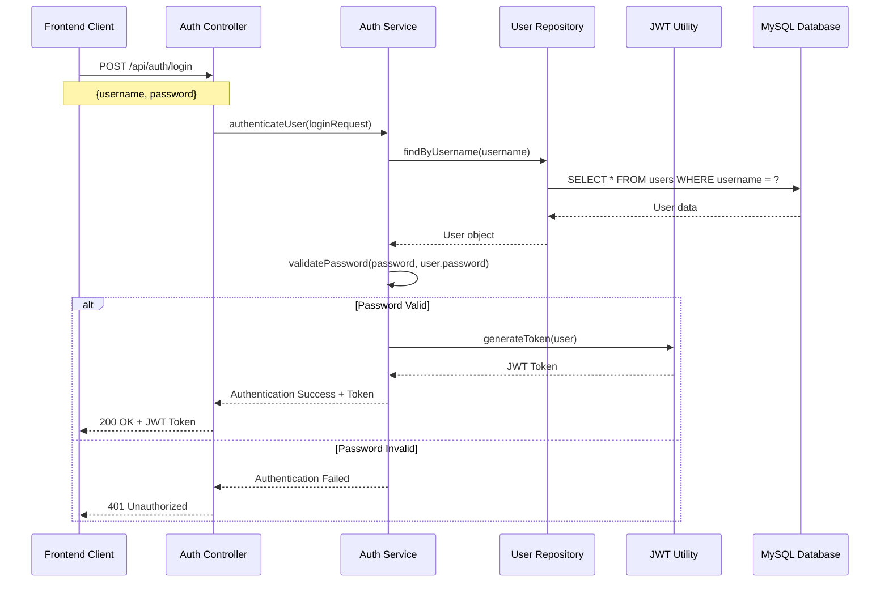
```mermaid
sequenceDiagram
    participant Client as Frontend Client
    participant AuthController as Auth Controller
    participant AuthService as Auth Service
    participant UserRepository as User Repository
    participant JwtUtil as JWT Utility
    participant Database as MySQL Database
    
    Client->>AuthController: POST /api/auth/login
    Note over Client,AuthController: {username, password}
    
    AuthController->>AuthService: authenticateUser(loginRequest)
    AuthService->>UserRepository: findByUsername(username)
    UserRepository->>Database: SELECT * FROM users WHERE username = ?
    Database-->>UserRepository: User data
    UserRepository-->>AuthService: User object
    
    AuthService->>AuthService: validatePassword(password, user.password)
    
    alt Password Valid
        AuthService->>JwtUtil: generateToken(user)
        JwtUtil-->>AuthService: JWT Token
        AuthService-->>AuthController: Authentication Success + Token
        AuthController-->>Client: 200 OK + JWT Token
    else Password Invalid
        AuthService-->>AuthController: Authentication Failed
        AuthController-->>Client: 401 Unauthorized
    end
```

## 2. User Management API Flow (Mermaid)

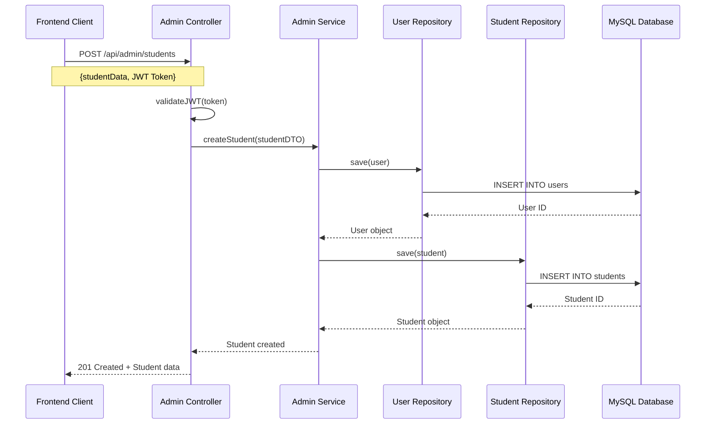
```mermaid
sequenceDiagram
    participant Client as Frontend Client
    participant AdminController as Admin Controller
    participant AdminService as Admin Service
    participant UserRepository as User Repository
    participant StudentRepository as Student Repository
    participant Database as MySQL Database
    
    Client->>AdminController: POST /api/admin/students
    Note over Client,AdminController: {studentData, JWT Token}
    
    AdminController->>AdminController: validateJWT(token)
    AdminController->>AdminService: createStudent(studentDTO)
    
    AdminService->>UserRepository: save(user)
    UserRepository->>Database: INSERT INTO users
    Database-->>UserRepository: User ID
    UserRepository-->>AdminService: User object
    
    AdminService->>StudentRepository: save(student)
    StudentRepository->>Database: INSERT INTO students
    Database-->>StudentRepository: Student ID
    StudentRepository-->>AdminService: Student object
    
    AdminService-->>AdminController: Student created
    AdminController-->>Client: 201 Created + Student data
```

## 3. Exam Management API Flow (Mermaid)

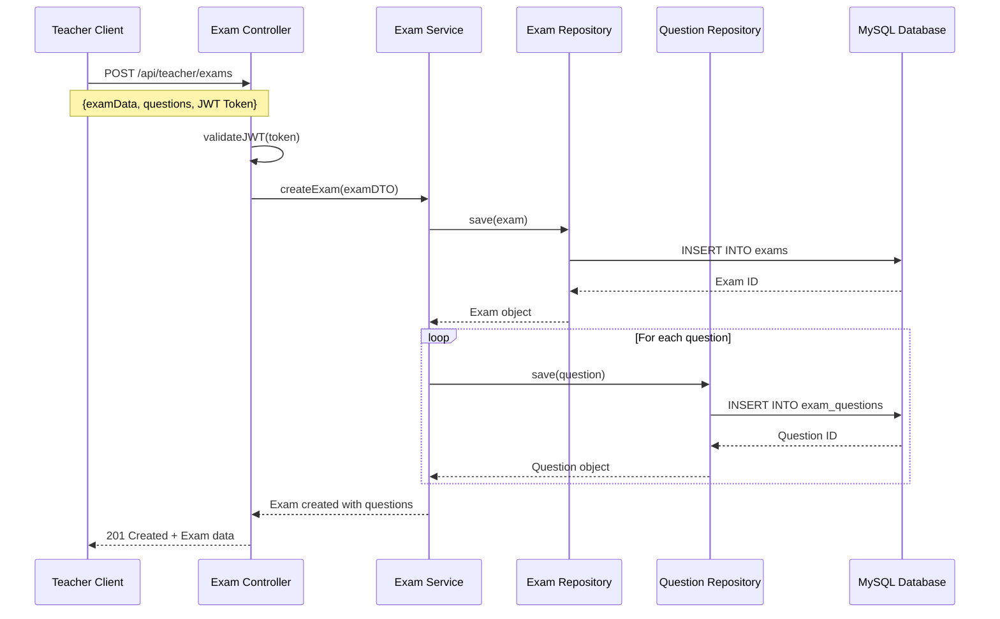
```mermaid
sequenceDiagram
    participant Teacher as Teacher Client
    participant ExamController as Exam Controller
    participant ExamService as Exam Service
    participant ExamRepository as Exam Repository
    participant QuestionRepository as Question Repository
    participant Database as MySQL Database
    
    Teacher->>ExamController: POST /api/teacher/exams
    Note over Teacher,ExamController: {examData, questions, JWT Token}
    
    ExamController->>ExamController: validateJWT(token)
    ExamController->>ExamService: createExam(examDTO)
    
    ExamService->>ExamRepository: save(exam)
    ExamRepository->>Database: INSERT INTO exams
    Database-->>ExamRepository: Exam ID
    ExamRepository-->>ExamService: Exam object
    
    loop For each question
        ExamService->>QuestionRepository: save(question)
        QuestionRepository->>Database: INSERT INTO exam_questions
        Database-->>QuestionRepository: Question ID
        QuestionRepository-->>ExamService: Question object
    end
    
    ExamService-->>ExamController: Exam created with questions
    ExamController-->>Teacher: 201 Created + Exam data
```

## 4. Student Exam Taking Flow (Mermaid)

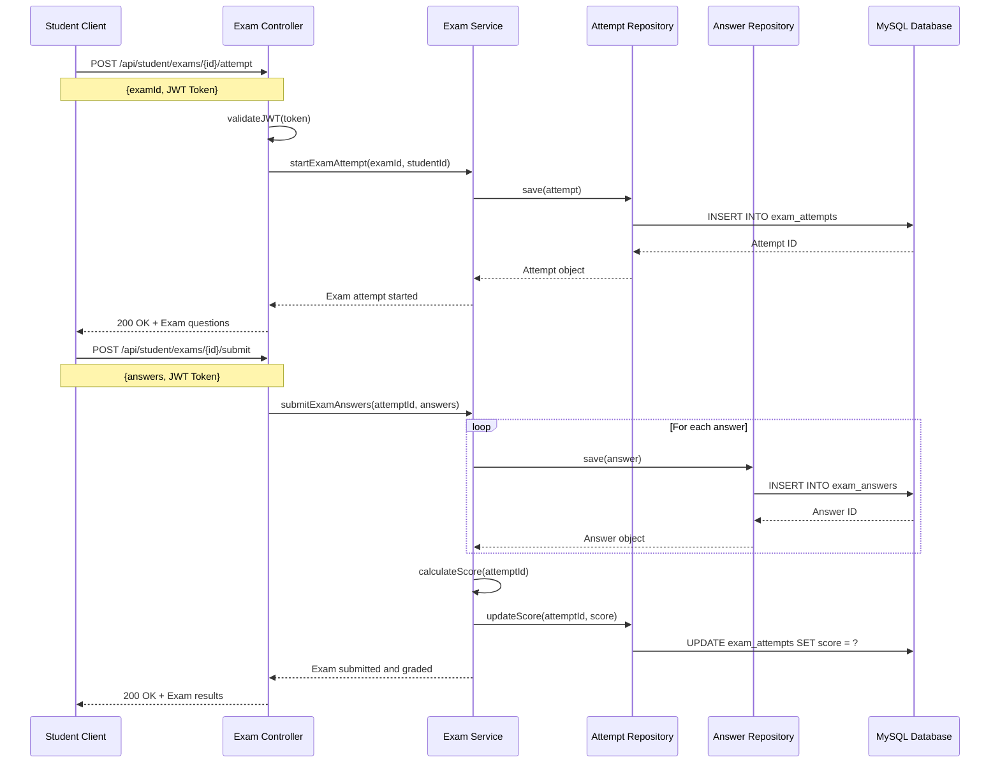
```mermaid
sequenceDiagram
    participant Student as Student Client
    participant ExamController as Exam Controller
    participant ExamService as Exam Service
    participant AttemptRepository as Attempt Repository
    participant AnswerRepository as Answer Repository
    participant Database as MySQL Database
    
    Student->>ExamController: POST /api/student/exams/{id}/attempt
    Note over Student,ExamController: {examId, JWT Token}
    
    ExamController->>ExamController: validateJWT(token)
    ExamController->>ExamService: startExamAttempt(examId, studentId)
    
    ExamService->>AttemptRepository: save(attempt)
    AttemptRepository->>Database: INSERT INTO exam_attempts
    Database-->>AttemptRepository: Attempt ID
    AttemptRepository-->>ExamService: Attempt object
    
    ExamService-->>ExamController: Exam attempt started
    ExamController-->>Student: 200 OK + Exam questions
    
    Student->>ExamController: POST /api/student/exams/{id}/submit
    Note over Student,ExamController: {answers, JWT Token}
    
    ExamController->>ExamService: submitExamAnswers(attemptId, answers)
    
    loop For each answer
        ExamService->>AnswerRepository: save(answer)
        AnswerRepository->>Database: INSERT INTO exam_answers
        Database-->>AnswerRepository: Answer ID
        AnswerRepository-->>ExamService: Answer object
    end
    
    ExamService->>ExamService: calculateScore(attemptId)
    ExamService->>AttemptRepository: updateScore(attemptId, score)
    AttemptRepository->>Database: UPDATE exam_attempts SET score = ?
    
    ExamService-->>ExamController: Exam submitted and graded
    ExamController-->>Student: 200 OK + Exam results
```

## 5. Assignment Management API Flow (Mermaid)

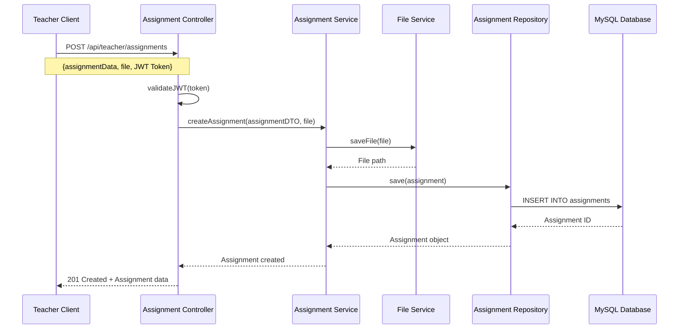
```mermaid
sequenceDiagram
    participant Teacher as Teacher Client
    participant AssignmentController as Assignment Controller
    participant AssignmentService as Assignment Service
    participant FileService as File Service
    participant AssignmentRepository as Assignment Repository
    participant Database as MySQL Database
    
    Teacher->>AssignmentController: POST /api/teacher/assignments
    Note over Teacher,AssignmentController: {assignmentData, file, JWT Token}
    
    AssignmentController->>AssignmentController: validateJWT(token)
    AssignmentController->>AssignmentService: createAssignment(assignmentDTO, file)
    
    AssignmentService->>FileService: saveFile(file)
    FileService-->>AssignmentService: File path
    
    AssignmentService->>AssignmentRepository: save(assignment)
    AssignmentRepository->>Database: INSERT INTO assignments
    Database-->>AssignmentRepository: Assignment ID
    AssignmentRepository-->>AssignmentService: Assignment object
    
    AssignmentService-->>AssignmentController: Assignment created
    AssignmentController-->>Teacher: 201 Created + Assignment data
```

## 6. Real-time Chat API Flow (Mermaid)

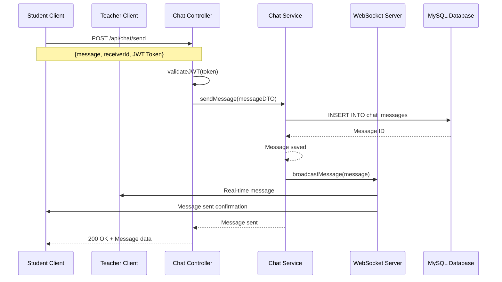
```mermaid
sequenceDiagram
    participant Client1 as Student Client
    participant Client2 as Teacher Client
    participant ChatController as Chat Controller
    participant ChatService as Chat Service
    participant WebSocket as WebSocket Server
    participant Database as MySQL Database
    
    Client1->>ChatController: POST /api/chat/send
    Note over Client1,ChatController: {message, receiverId, JWT Token}
    
    ChatController->>ChatController: validateJWT(token)
    ChatController->>ChatService: sendMessage(messageDTO)
    
    ChatService->>Database: INSERT INTO chat_messages
    Database-->>ChatService: Message ID
    ChatService-->>ChatService: Message saved
    
    ChatService->>WebSocket: broadcastMessage(message)
    WebSocket->>Client2: Real-time message
    WebSocket->>Client1: Message sent confirmation
    
    ChatService-->>ChatController: Message sent
    ChatController-->>Client1: 200 OK + Message data
```

## 7. File Upload API Flow (Mermaid)

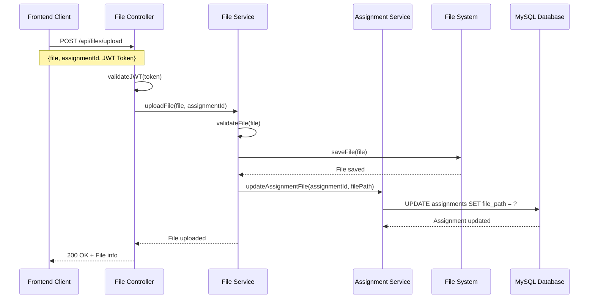
```mermaid
sequenceDiagram
    participant Client as Frontend Client
    participant FileController as File Controller
    participant FileService as File Service
    participant AssignmentService as Assignment Service
    participant FileSystem as File System
    participant Database as MySQL Database
    
    Client->>FileController: POST /api/files/upload
    Note over Client,FileController: {file, assignmentId, JWT Token}
    
    FileController->>FileController: validateJWT(token)
    FileController->>FileService: uploadFile(file, assignmentId)
    
    FileService->>FileService: validateFile(file)
    FileService->>FileSystem: saveFile(file)
    FileSystem-->>FileService: File saved
    
    FileService->>AssignmentService: updateAssignmentFile(assignmentId, filePath)
    AssignmentService->>Database: UPDATE assignments SET file_path = ?
    Database-->>AssignmentService: Assignment updated
    
    FileService-->>FileController: File uploaded
    FileController-->>Client: 200 OK + File info
```

## 8. Notification API Flow (Mermaid)

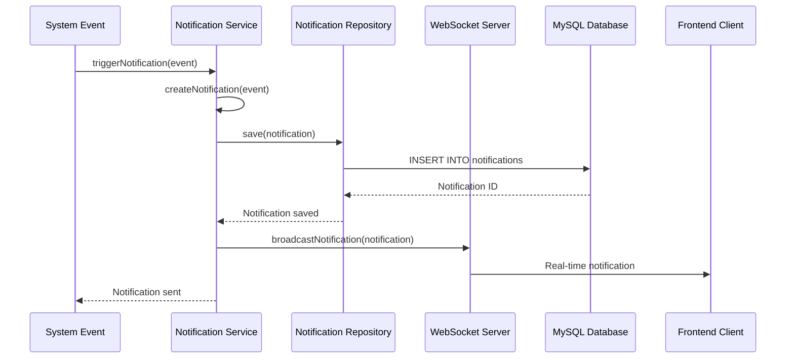
```mermaid
sequenceDiagram
    participant System as System Event
    participant NotificationService as Notification Service
    participant NotificationRepository as Notification Repository
    participant WebSocket as WebSocket Server
    participant Database as MySQL Database
    participant Client as Frontend Client
    
    System->>NotificationService: triggerNotification(event)
    NotificationService->>NotificationService: createNotification(event)
    
    NotificationService->>NotificationRepository: save(notification)
    NotificationRepository->>Database: INSERT INTO notifications
    Database-->>NotificationRepository: Notification ID
    NotificationRepository-->>NotificationService: Notification saved
    
    NotificationService->>WebSocket: broadcastNotification(notification)
    WebSocket->>Client: Real-time notification
    
    NotificationService-->>System: Notification sent
```

## 9. Leave Request API Flow (Mermaid)

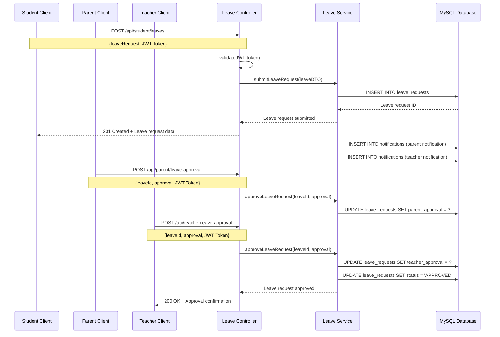
```mermaid
sequenceDiagram
    participant Student as Student Client
    participant Parent as Parent Client
    participant Teacher as Teacher Client
    participant LeaveController as Leave Controller
    participant LeaveService as Leave Service
    participant Database as MySQL Database
    
    Student->>LeaveController: POST /api/student/leaves
    Note over Student,LeaveController: {leaveRequest, JWT Token}
    
    LeaveController->>LeaveController: validateJWT(token)
    LeaveController->>LeaveService: submitLeaveRequest(leaveDTO)
    
    LeaveService->>Database: INSERT INTO leave_requests
    Database-->>LeaveService: Leave request ID
    LeaveService-->>LeaveController: Leave request submitted
    LeaveController-->>Student: 201 Created + Leave request data
    
    LeaveService->>Database: INSERT INTO notifications (parent notification)
    LeaveService->>Database: INSERT INTO notifications (teacher notification)
    
    Parent->>LeaveController: POST /api/parent/leave-approval
    Note over Parent,LeaveController: {leaveId, approval, JWT Token}
    
    LeaveController->>LeaveService: approveLeaveRequest(leaveId, approval)
    LeaveService->>Database: UPDATE leave_requests SET parent_approval = ?
    
    Teacher->>LeaveController: POST /api/teacher/leave-approval
    Note over Teacher,LeaveController: {leaveId, approval, JWT Token}
    
    LeaveController->>LeaveService: approveLeaveRequest(leaveId, approval)
    LeaveService->>Database: UPDATE leave_requests SET teacher_approval = ?
    
    LeaveService->>Database: UPDATE leave_requests SET status = 'APPROVED'
    LeaveService-->>LeaveController: Leave request approved
    LeaveController-->>Teacher: 200 OK + Approval confirmation
```

## 10. Online Class API Flow (Mermaid)

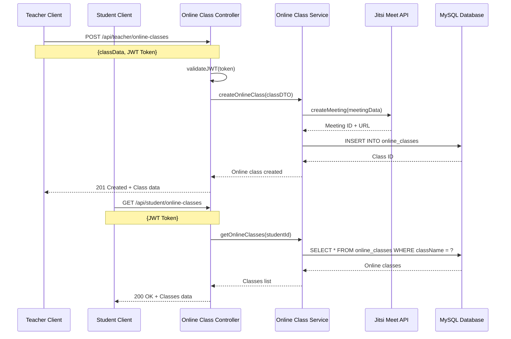
```mermaid
sequenceDiagram
    participant Teacher as Teacher Client
    participant Student as Student Client
    participant OnlineClassController as Online Class Controller
    participant OnlineClassService as Online Class Service
    participant JitsiAPI as Jitsi Meet API
    participant Database as MySQL Database
    
    Teacher->>OnlineClassController: POST /api/teacher/online-classes
    Note over Teacher,OnlineClassController: {classData, JWT Token}
    
    OnlineClassController->>OnlineClassController: validateJWT(token)
    OnlineClassController->>OnlineClassService: createOnlineClass(classDTO)
    
    OnlineClassService->>JitsiAPI: createMeeting(meetingData)
    JitsiAPI-->>OnlineClassService: Meeting ID + URL
    
    OnlineClassService->>Database: INSERT INTO online_classes
    Database-->>OnlineClassService: Class ID
    OnlineClassService-->>OnlineClassController: Online class created
    OnlineClassController-->>Teacher: 201 Created + Class data
    
    Student->>OnlineClassController: GET /api/student/online-classes
    Note over Student,OnlineClassController: {JWT Token}
    
    OnlineClassController->>OnlineClassService: getOnlineClasses(studentId)
    OnlineClassService->>Database: SELECT * FROM online_classes WHERE className = ?
    Database-->>OnlineClassService: Online classes
    OnlineClassService-->>OnlineClassController: Classes list
    OnlineClassController-->>Student: 200 OK + Classes data
```

## 11. API Error Handling Flow (Mermaid)

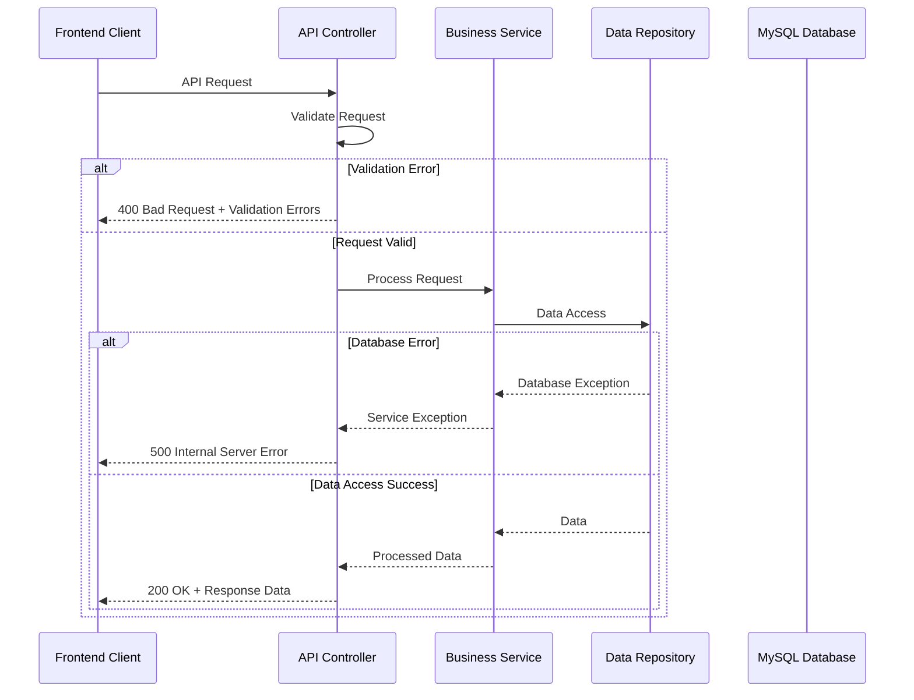
```mermaid
sequenceDiagram
    participant Client as Frontend Client
    participant Controller as API Controller
    participant Service as Business Service
    participant Repository as Data Repository
    participant Database as MySQL Database
    
    Client->>Controller: API Request
    Controller->>Controller: Validate Request
    
    alt Validation Error
        Controller-->>Client: 400 Bad Request + Validation Errors
    else Request Valid
        Controller->>Service: Process Request
        Service->>Repository: Data Access
        
        alt Database Error
            Repository-->>Service: Database Exception
            Service-->>Controller: Service Exception
            Controller-->>Client: 500 Internal Server Error
        else Data Access Success
            Repository-->>Service: Data
            Service-->>Controller: Processed Data
            Controller-->>Client: 200 OK + Response Data
        end
    end
```

## 12. API Rate Limiting Flow (Mermaid)

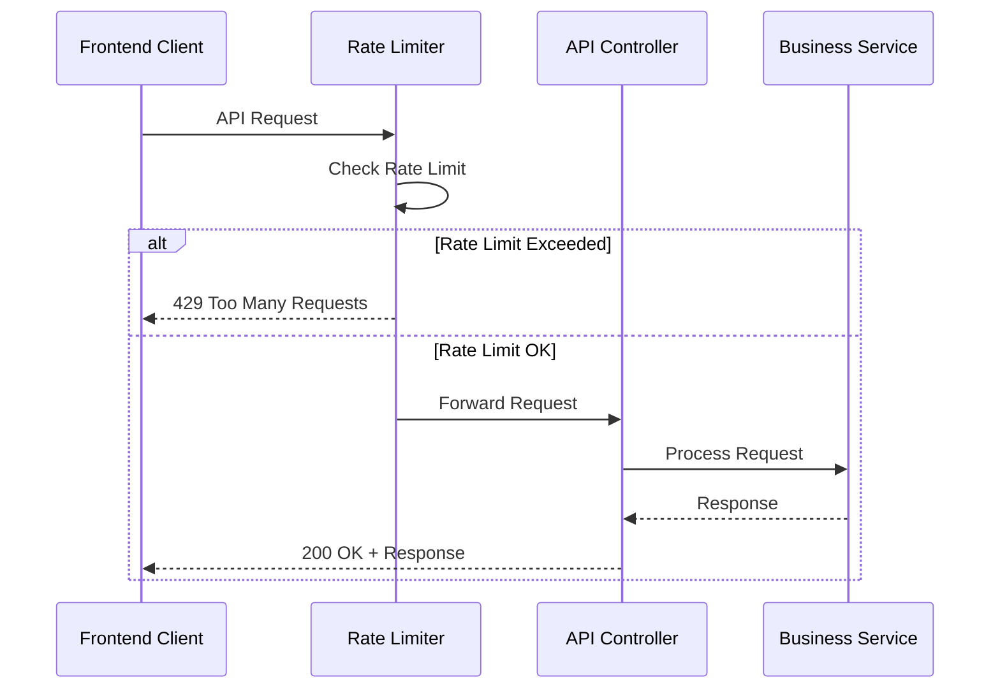
```mermaid
sequenceDiagram
    participant Client as Frontend Client
    participant RateLimiter as Rate Limiter
    participant Controller as API Controller
    participant Service as Business Service
    
    Client->>RateLimiter: API Request
    RateLimiter->>RateLimiter: Check Rate Limit
    
    alt Rate Limit Exceeded
        RateLimiter-->>Client: 429 Too Many Requests
    else Rate Limit OK
        RateLimiter->>Controller: Forward Request
        Controller->>Service: Process Request
        Service-->>Controller: Response
        Controller-->>Client: 200 OK + Response
    end
```

## 13. API Caching Flow (Mermaid)

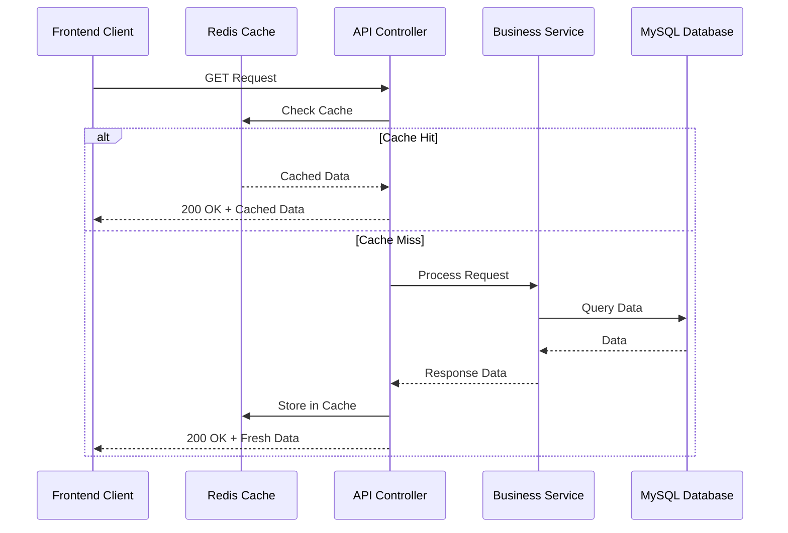
```mermaid
sequenceDiagram
    participant Client as Frontend Client
    participant Cache as Redis Cache
    participant Controller as API Controller
    participant Service as Business Service
    participant Database as MySQL Database
    
    Client->>Controller: GET Request
    Controller->>Cache: Check Cache
    
    alt Cache Hit
        Cache-->>Controller: Cached Data
        Controller-->>Client: 200 OK + Cached Data
    else Cache Miss
        Controller->>Service: Process Request
        Service->>Database: Query Data
        Database-->>Service: Data
        Service-->>Controller: Response Data
        Controller->>Cache: Store in Cache
        Controller-->>Client: 200 OK + Fresh Data
    end
```

## 14. API Security Flow (Mermaid)

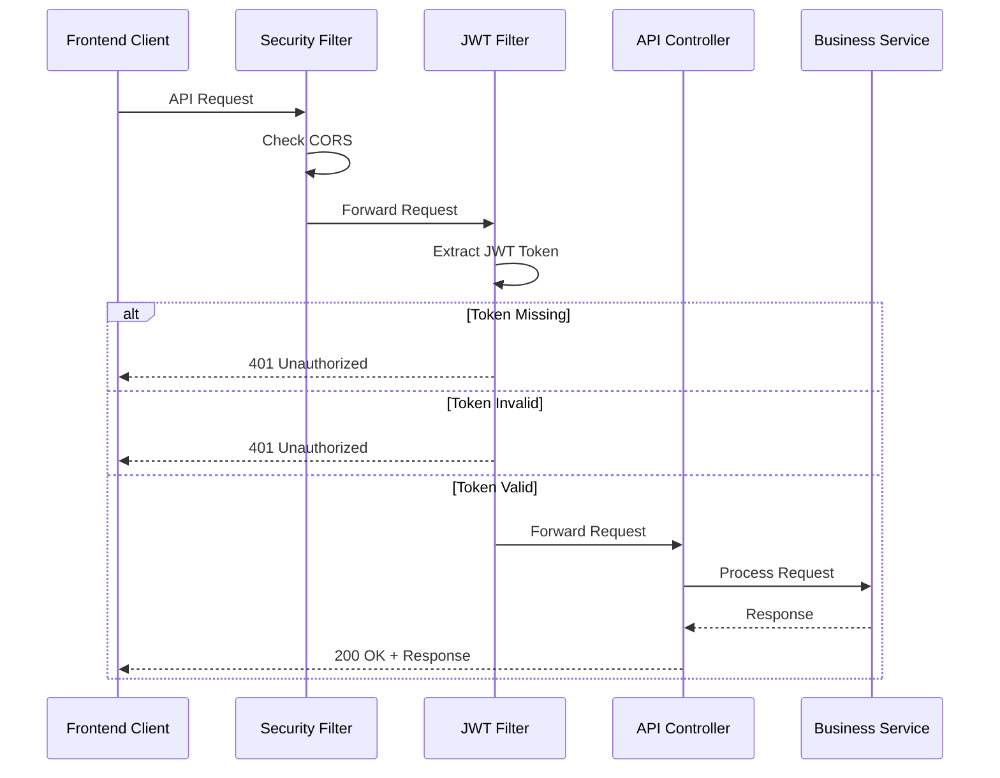
```mermaid
sequenceDiagram
    participant Client as Frontend Client
    participant SecurityFilter as Security Filter
    participant JwtFilter as JWT Filter
    participant Controller as API Controller
    participant Service as Business Service
    
    Client->>SecurityFilter: API Request
    SecurityFilter->>SecurityFilter: Check CORS
    SecurityFilter->>JwtFilter: Forward Request
    
    JwtFilter->>JwtFilter: Extract JWT Token
    
    alt Token Missing
        JwtFilter-->>Client: 401 Unauthorized
    else Token Invalid
        JwtFilter-->>Client: 401 Unauthorized
    else Token Valid
        JwtFilter->>Controller: Forward Request
        Controller->>Service: Process Request
        Service-->>Controller: Response
        Controller-->>Client: 200 OK + Response
    end
```

## 15. API Monitoring Flow (Mermaid)

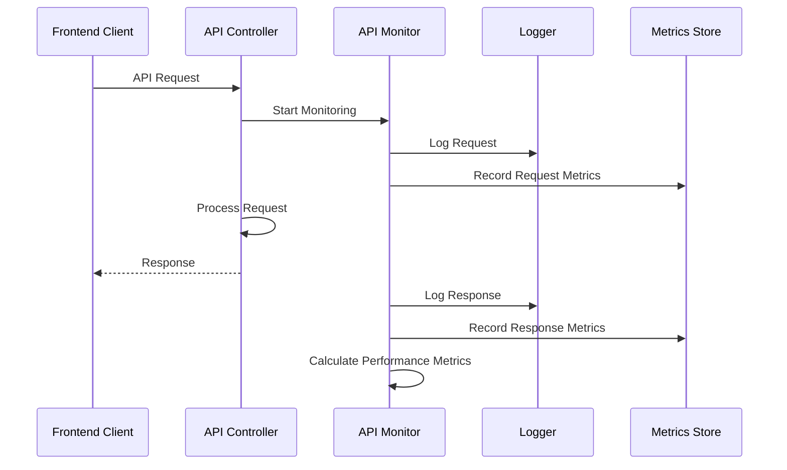
```mermaid
sequenceDiagram
    participant Client as Frontend Client
    participant Controller as API Controller
    participant Monitor as API Monitor
    participant Logger as Logger
    participant Metrics as Metrics Store
    
    Client->>Controller: API Request
    Controller->>Monitor: Start Monitoring
    
    Monitor->>Logger: Log Request
    Monitor->>Metrics: Record Request Metrics
    
    Controller->>Controller: Process Request
    Controller-->>Client: Response
    
    Monitor->>Logger: Log Response
    Monitor->>Metrics: Record Response Metrics
    Monitor->>Monitor: Calculate Performance Metrics
```

## 16. API Versioning Flow (Mermaid)

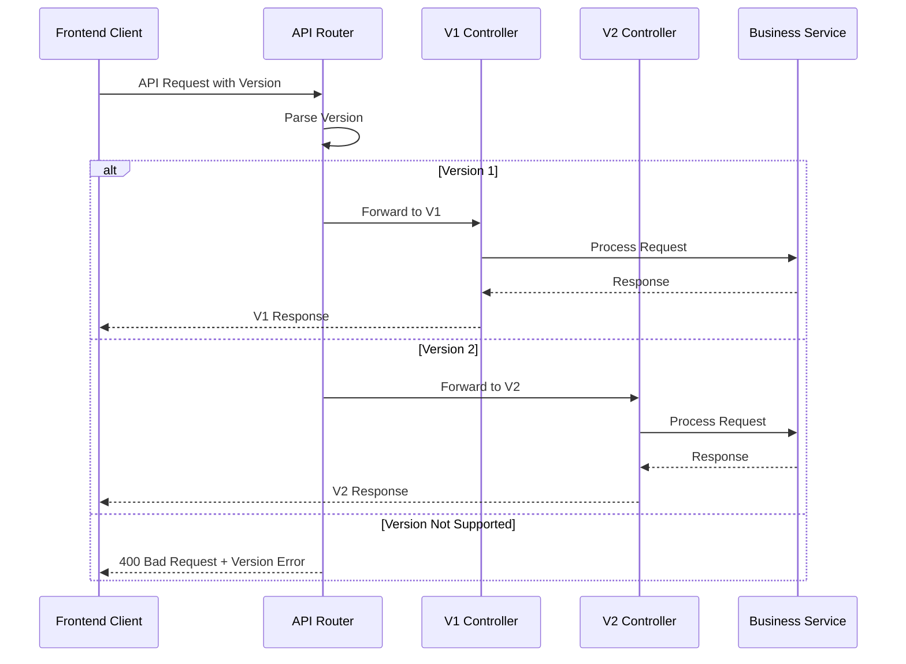
```mermaid
sequenceDiagram
    participant Client as Frontend Client
    participant Router as API Router
    participant V1Controller as V1 Controller
    participant V2Controller as V2 Controller
    participant Service as Business Service
    
    Client->>Router: API Request with Version
    Router->>Router: Parse Version
    
    alt Version 1
        Router->>V1Controller: Forward to V1
        V1Controller->>Service: Process Request
        Service-->>V1Controller: Response
        V1Controller-->>Client: V1 Response
    else Version 2
        Router->>V2Controller: Forward to V2
        V2Controller->>Service: Process Request
        Service-->>V2Controller: Response
        V2Controller-->>Client: V2 Response
    else Version Not Supported
        Router-->>Client: 400 Bad Request + Version Error
    end
```

## 17. API Documentation Flow (Mermaid)

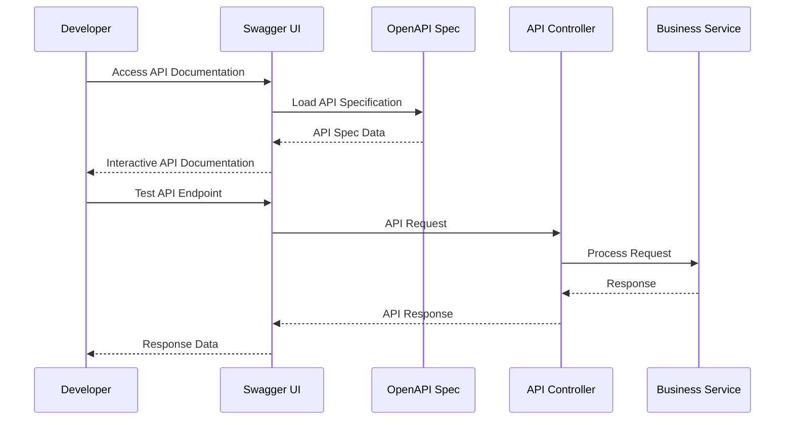
```mermaid
sequenceDiagram
    participant Developer as Developer
    participant SwaggerUI as Swagger UI
    participant OpenAPI as OpenAPI Spec
    participant Controller as API Controller
    participant Service as Business Service
    
    Developer->>SwaggerUI: Access API Documentation
    SwaggerUI->>OpenAPI: Load API Specification
    OpenAPI-->>SwaggerUI: API Spec Data
    SwaggerUI-->>Developer: Interactive API Documentation
    
    Developer->>SwaggerUI: Test API Endpoint
    SwaggerUI->>Controller: API Request
    Controller->>Service: Process Request
    Service-->>Controller: Response
    Controller-->>SwaggerUI: API Response
    SwaggerUI-->>Developer: Response Data
```

## 18. API Testing Flow (Mermaid)

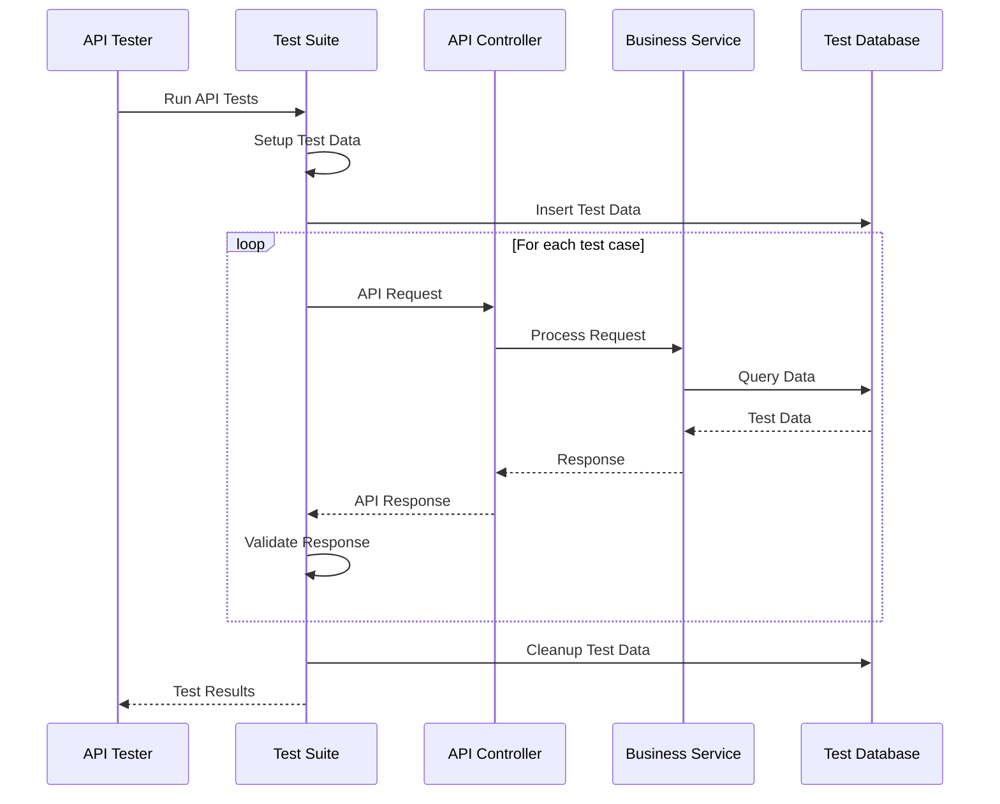
```mermaid
sequenceDiagram
    participant Tester as API Tester
    participant TestSuite as Test Suite
    participant Controller as API Controller
    participant Service as Business Service
    participant Database as Test Database
    
    Tester->>TestSuite: Run API Tests
    TestSuite->>TestSuite: Setup Test Data
    TestSuite->>Database: Insert Test Data
    
    loop For each test case
        TestSuite->>Controller: API Request
        Controller->>Service: Process Request
        Service->>Database: Query Data
        Database-->>Service: Test Data
        Service-->>Controller: Response
        Controller-->>TestSuite: API Response
        TestSuite->>TestSuite: Validate Response
    end
    
    TestSuite->>Database: Cleanup Test Data
    TestSuite-->>Tester: Test Results
```

## 19. API Deployment Flow (Mermaid)

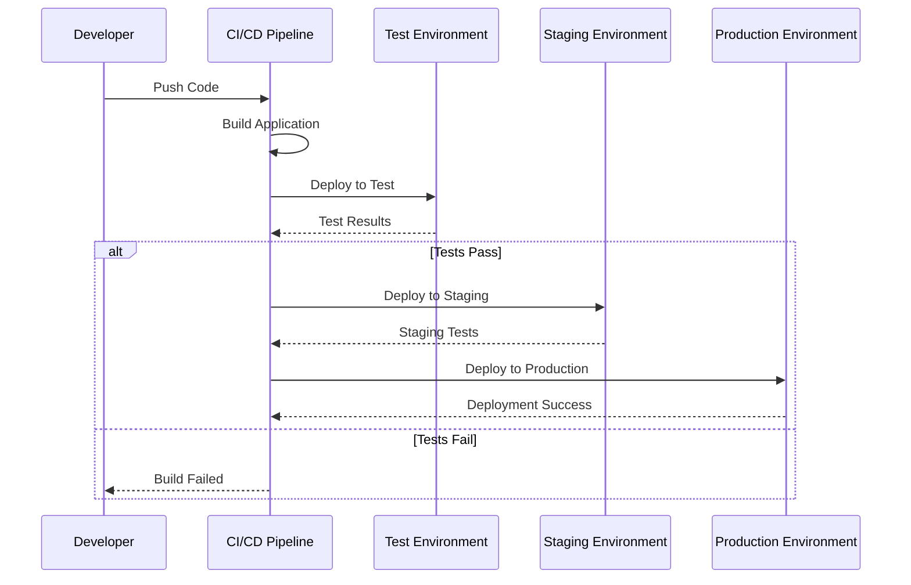
```mermaid
sequenceDiagram
    participant Developer as Developer
    participant CICD as CI/CD Pipeline
    participant TestEnv as Test Environment
    participant StagingEnv as Staging Environment
    participant ProdEnv as Production Environment
    
    Developer->>CICD: Push Code
    CICD->>CICD: Build Application
    CICD->>TestEnv: Deploy to Test
    TestEnv-->>CICD: Test Results
    
    alt Tests Pass
        CICD->>StagingEnv: Deploy to Staging
        StagingEnv-->>CICD: Staging Tests
        CICD->>ProdEnv: Deploy to Production
        ProdEnv-->>CICD: Deployment Success
    else Tests Fail
        CICD-->>Developer: Build Failed
    end
```

## 20. API Health Check Flow (Mermaid)

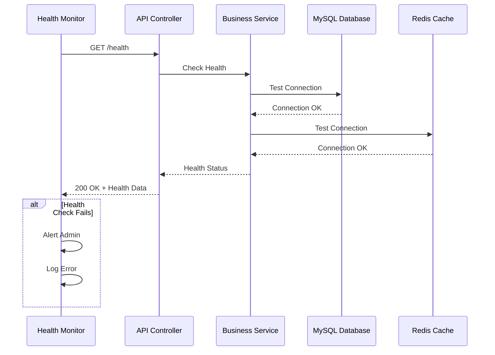
```mermaid
sequenceDiagram
    participant Monitor as Health Monitor
    participant Controller as API Controller
    participant Service as Business Service
    participant Database as MySQL Database
    participant Cache as Redis Cache
    
    Monitor->>Controller: GET /health
    Controller->>Service: Check Health
    Service->>Database: Test Connection
    Database-->>Service: Connection OK
    Service->>Cache: Test Connection
    Cache-->>Service: Connection OK
    Service-->>Controller: Health Status
    Controller-->>Monitor: 200 OK + Health Data
    
    alt Health Check Fails
        Monitor->>Monitor: Alert Admin
        Monitor->>Monitor: Log Error
    end
```

---

*These API flow diagrams provide a comprehensive view of how different API endpoints work, including authentication, data flow, error handling, and various system integrations.*
