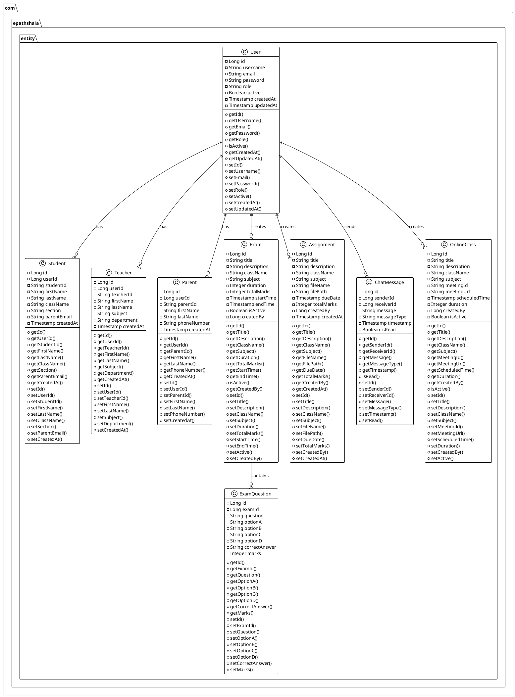
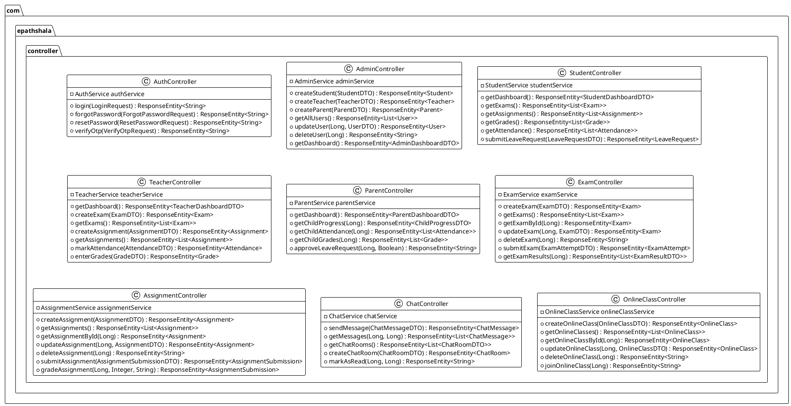
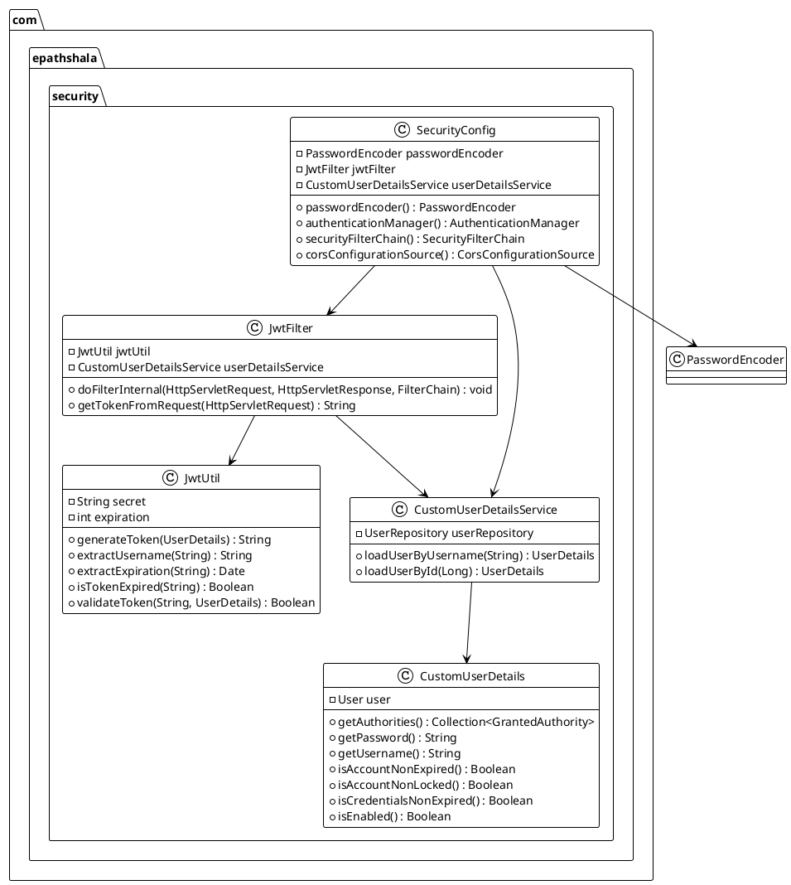
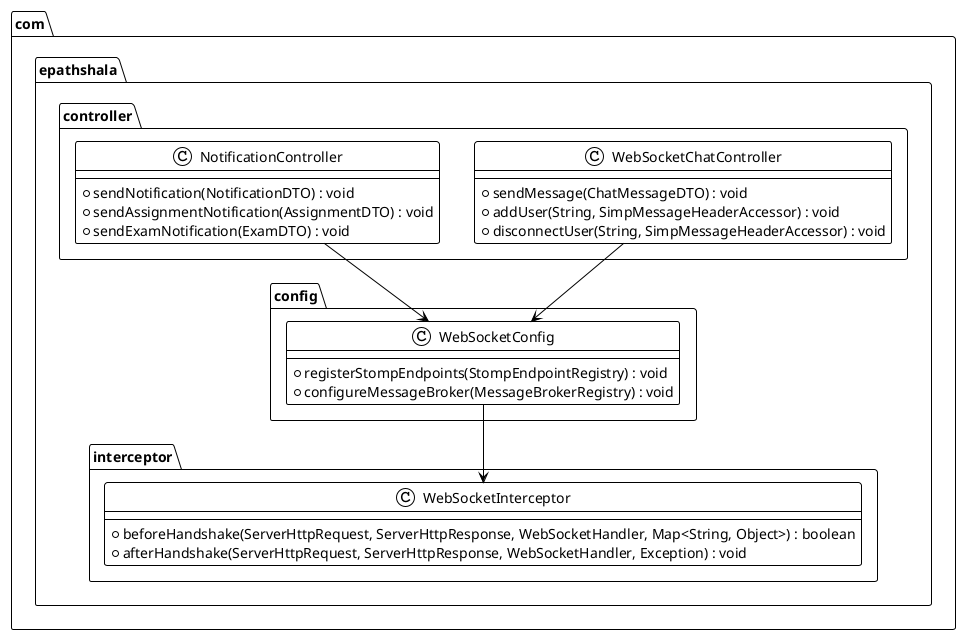
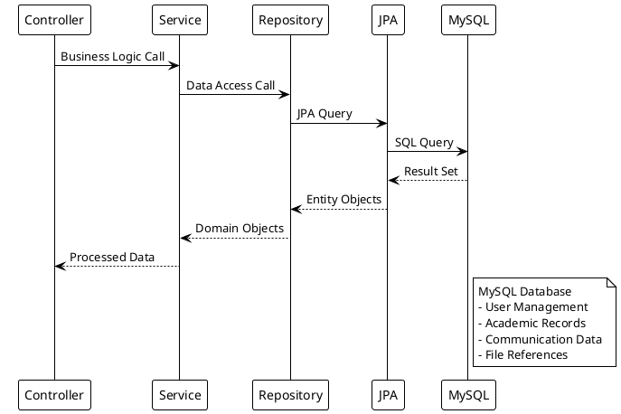
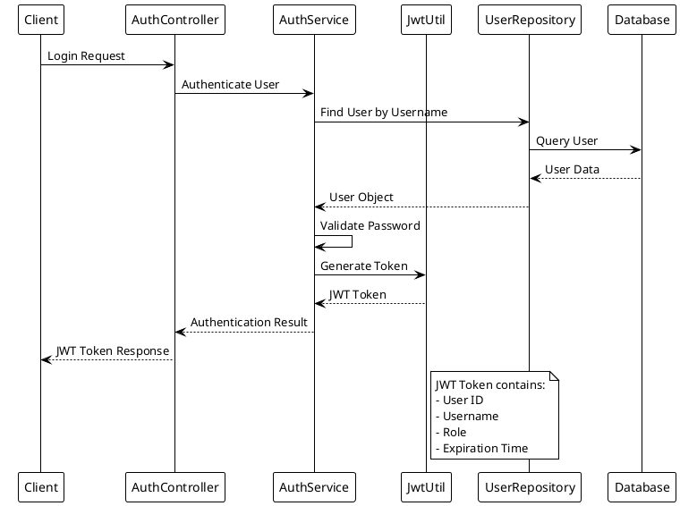
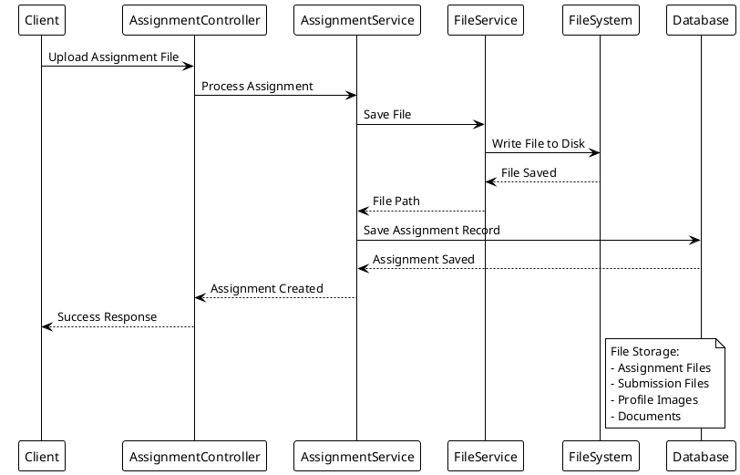

# Backend Architecture - PlantUML Diagrams

## 1. Class Diagram - Core Entities

## 2. Service Layer Architecture

```plantuml
@startuml
!theme plain

package "com.epathshala.service" {
    interface AuthService {
        +authenticateUser(LoginRequest) : String
        +generateToken(User) : String
        +validateToken(String) : Boolean
        +forgotPassword(String) : Boolean
        +resetPassword(ResetPasswordRequest) : Boolean
        +verifyOtp(String, String) : Boolean
    }

    class AuthServiceImpl {
        -UserRepository userRepository
        -JwtUtil jwtUtil
        -PasswordEncoder passwordEncoder
        -EmailService emailService
        -OtpRepository otpRepository
        +authenticateUser(LoginRequest) : String
        +generateToken(User) : String
        +validateToken(String) : Boolean
        +forgotPassword(String) : Boolean
        +resetPassword(ResetPasswordRequest) : Boolean
        +verifyOtp(String, String) : Boolean
    }

    interface AdminService {
        +createStudent(StudentDTO) : Student
        +createTeacher(TeacherDTO) : Teacher
        +createParent(ParentDTO) : Parent
        +getAllUsers() : List<User>
        +updateUser(Long, UserDTO) : User
        +deleteUser(Long) : Boolean
        +getDashboardData() : AdminDashboardDTO
    }

    class AdminServiceImpl {
        -UserRepository userRepository
        -StudentRepository studentRepository
        -TeacherRepository teacherRepository
        -ParentRepository parentRepository
        -PasswordEncoder passwordEncoder
        +createStudent(StudentDTO) : Student
        +createTeacher(TeacherDTO) : Teacher
        +createParent(ParentDTO) : Parent
        +getAllUsers() : List<User>
        +updateUser(Long, UserDTO) : User
        +deleteUser(Long) : Boolean
        +getDashboardData() : AdminDashboardDTO
    }

    interface ExamService {
        +createExam(ExamDTO) : Exam
        +getExamsByTeacher(Long) : List<Exam>
        +getExamsByClass(String) : List<Exam>
        +getExamById(Long) : Exam
        +updateExam(Long, ExamDTO) : Exam
        +deleteExam(Long) : Boolean
        +submitExamAttempt(ExamAttemptDTO) : ExamAttempt
        +getExamResults(Long) : List<ExamResultDTO>
    }

    class ExamServiceImpl {
        -ExamRepository examRepository
        -ExamQuestionRepository examQuestionRepository
        -ExamAttemptRepository examAttemptRepository
        -ExamAnswerRepository examAnswerRepository
        -StudentRepository studentRepository
        +createExam(ExamDTO) : Exam
        +getExamsByTeacher(Long) : List<Exam>
        +getExamsByClass(String) : List<Exam>
        +getExamById(Long) : Exam
        +updateExam(Long, ExamDTO) : Exam
        +deleteExam(Long) : Boolean
        +submitExamAttempt(ExamAttemptDTO) : ExamAttempt
        +getExamResults(Long) : List<ExamResultDTO>
    }

    interface AssignmentService {
        +createAssignment(AssignmentDTO) : Assignment
        +getAssignmentsByTeacher(Long) : List<Assignment>
        +getAssignmentsByClass(String) : List<Assignment>
        +getAssignmentById(Long) : Assignment
        +updateAssignment(Long, AssignmentDTO) : Assignment
        +deleteAssignment(Long) : Boolean
        +submitAssignment(AssignmentSubmissionDTO) : AssignmentSubmission
        +gradeAssignment(Long, Integer, String) : AssignmentSubmission
    }

    class AssignmentServiceImpl {
        -AssignmentRepository assignmentRepository
        -AssignmentSubmissionRepository assignmentSubmissionRepository
        -StudentRepository studentRepository
        -FileService fileService
        +createAssignment(AssignmentDTO) : Assignment
        +getAssignmentsByTeacher(Long) : List<Assignment>
        +getAssignmentsByClass(String) : List<Assignment>
        +getAssignmentById(Long) : Assignment
        +updateAssignment(Long, AssignmentDTO) : Assignment
        +deleteAssignment(Long) : Boolean
        +submitAssignment(AssignmentSubmissionDTO) : AssignmentSubmission
        +gradeAssignment(Long, Integer, String) : AssignmentSubmission
    }

    interface ChatService {
        +sendMessage(ChatMessageDTO) : ChatMessage
        +getMessages(Long, Long) : List<ChatMessage>
        +getChatRooms(Long) : List<ChatRoomDTO>
        +createChatRoom(ChatRoomDTO) : ChatRoom
        +markAsRead(Long, Long) : Boolean
    }

    class ChatServiceImpl {
        -ChatMessageRepository chatMessageRepository
        -ChatRoomRepository chatRoomRepository
        -UserRepository userRepository
        -NotificationService notificationService
        +sendMessage(ChatMessageDTO) : ChatMessage
        +getMessages(Long, Long) : List<ChatMessage>
        +getChatRooms(Long) : List<ChatRoomDTO>
        +createChatRoom(ChatRoomDTO) : ChatRoom
        +markAsRead(Long, Long) : Boolean
    }
}

AuthService <|.. AuthServiceImpl
AdminService <|.. AdminServiceImpl
ExamService <|.. ExamServiceImpl
AssignmentService <|.. AssignmentServiceImpl
ChatService <|.. ChatServiceImpl

@enduml
```

## 3. Controller Layer Architecture

## 4. Repository Layer Architecture

```plantuml
@startuml
!theme plain

package "com.epathshala.repository" {
    interface JpaRepository<T, ID> {
        +save(T) : T
        +findById(ID) : Optional<T>
        +findAll() : List<T>
        +deleteById(ID) : void
        +count() : long
    }

    interface UserRepository {
        +findByUsername(String) : Optional<User>
        +findByEmail(String) : Optional<User>
        +findByRole(String) : List<User>
        +findByActive(Boolean) : List<User>
    }

    interface StudentRepository {
        +findByUserId(Long) : Optional<Student>
        +findByClassName(String) : List<Student>
        +findByParentEmail(String) : List<Student>
        +findByStudentId(String) : Optional<Student>
    }

    interface TeacherRepository {
        +findByUserId(Long) : Optional<Teacher>
        +findBySubject(String) : List<Teacher>
        +findByDepartment(String) : List<Teacher>
        +findByTeacherId(String) : Optional<Teacher>
    }

    interface ParentRepository {
        +findByUserId(Long) : Optional<Parent>
        +findByParentId(String) : Optional<Parent>
        +findByPhoneNumber(String) : Optional<Parent>
    }

    interface ExamRepository {
        +findByCreatedBy(Long) : List<Exam>
        +findByClassName(String) : List<Exam>
        +findBySubject(String) : List<Exam>
        +findByIsActive(Boolean) : List<Exam>
        +findByStartTimeBetween(Timestamp, Timestamp) : List<Exam>
    }

    interface ExamQuestionRepository {
        +findByExamId(Long) : List<ExamQuestion>
        +findByExamIdOrderByCreatedAt(Long) : List<ExamQuestion>
    }

    interface ExamAttemptRepository {
        +findByExamId(Long) : List<ExamAttempt>
        +findByStudentId(Long) : List<ExamAttempt>
        +findByExamIdAndStudentId(Long, Long) : Optional<ExamAttempt>
    }

    interface AssignmentRepository {
        +findByCreatedBy(Long) : List<Assignment>
        +findByClassName(String) : List<Assignment>
        +findBySubject(String) : List<Assignment>
        +findByDueDateAfter(Timestamp) : List<Assignment>
    }

    interface AssignmentSubmissionRepository {
        +findByAssignmentId(Long) : List<AssignmentSubmission>
        +findByStudentId(Long) : List<AssignmentSubmission>
        +findByAssignmentIdAndStudentId(Long, Long) : Optional<AssignmentSubmission>
    }

    interface ChatMessageRepository {
        +findBySenderIdAndReceiverId(Long, Long) : List<ChatMessage>
        +findByReceiverIdAndIsRead(Long, Boolean) : List<ChatMessage>
        +findBySenderIdOrReceiverId(Long, Long) : List<ChatMessage>
    }

    interface OnlineClassRepository {
        +findByCreatedBy(Long) : List<OnlineClass>
        +findByClassName(String) : List<OnlineClass>
        +findBySubject(String) : List<OnlineClass>
        +findByIsActive(Boolean) : List<OnlineClass>
        +findByScheduledTimeBetween(Timestamp, Timestamp) : List<OnlineClass>
    }
}

JpaRepository <|-- UserRepository
JpaRepository <|-- StudentRepository
JpaRepository <|-- TeacherRepository
JpaRepository <|-- ParentRepository
JpaRepository <|-- ExamRepository
JpaRepository <|-- ExamQuestionRepository
JpaRepository <|-- ExamAttemptRepository
JpaRepository <|-- AssignmentRepository
JpaRepository <|-- AssignmentSubmissionRepository
JpaRepository <|-- ChatMessageRepository
JpaRepository <|-- OnlineClassRepository

@enduml
```

## 5. Security Architecture

## 6. WebSocket Architecture

## 7. Complete Backend Architecture

```plantuml
@startuml
!theme plain

package "Presentation Layer" {
    [AuthController]
    [AdminController]
    [StudentController]
    [TeacherController]
    [ParentController]
    [ExamController]
    [AssignmentController]
    [ChatController]
    [OnlineClassController]
}

package "Service Layer" {
    [AuthService]
    [AdminService]
    [StudentService]
    [TeacherService]
    [ParentService]
    [ExamService]
    [AssignmentService]
    [ChatService]
    [OnlineClassService]
}

package "Repository Layer" {
    [UserRepository]
    [StudentRepository]
    [TeacherRepository]
    [ParentRepository]
    [ExamRepository]
    [AssignmentRepository]
    [ChatRepository]
    [OnlineClassRepository]
}

package "Entity Layer" {
    [User]
    [Student]
    [Teacher]
    [Parent]
    [Exam]
    [Assignment]
    [ChatMessage]
    [OnlineClass]
}

package "Security Layer" {
    [JwtUtil]
    [JwtFilter]
    [CustomUserDetailsService]
    [SecurityConfig]
}

package "Configuration Layer" {
    [WebSocketConfig]
    [SwaggerConfig]
    [WebConfig]
    [JacksonConfig]
}

[AuthController] --> [AuthService]
[AdminController] --> [AdminService]
[StudentController] --> [StudentService]
[TeacherController] --> [TeacherService]
[ParentController] --> [ParentService]
[ExamController] --> [ExamService]
[AssignmentController] --> [AssignmentService]
[ChatController] --> [ChatService]
[OnlineClassController] --> [OnlineClassService]

[AuthService] --> [UserRepository]
[AdminService] --> [UserRepository]
[StudentService] --> [StudentRepository]
[TeacherService] --> [TeacherRepository]
[ParentService] --> [ParentRepository]
[ExamService] --> [ExamRepository]
[AssignmentService] --> [AssignmentRepository]
[ChatService] --> [ChatRepository]
[OnlineClassService] --> [OnlineClassRepository]

[UserRepository] --> [User]
[StudentRepository] --> [Student]
[TeacherRepository] --> [Teacher]
[ParentRepository] --> [Parent]
[ExamRepository] --> [Exam]
[AssignmentRepository] --> [Assignment]
[ChatRepository] --> [ChatMessage]
[OnlineClassRepository] --> [OnlineClass]

[JwtFilter] --> [JwtUtil]
[JwtFilter] --> [CustomUserDetailsService]
[SecurityConfig] --> [JwtFilter]
[SecurityConfig] --> [CustomUserDetailsService]

@enduml
```

## 8. Database Connection Flow

## 9. Authentication Flow

## 10. File Upload Flow

---

*These PlantUML diagrams provide a comprehensive view of the backend architecture, including class relationships, service interactions, and data flow patterns.*
