# ePathshala - Comprehensive Project Documentation

## Table of Contents
1. [Project Overview](#project-overview)
2. [System Architecture](#system-architecture)
3. [Backend Documentation](#backend-documentation)
4. [Frontend Documentation](#frontend-documentation)
5. [Database Design](#database-design)
6. [API Documentation](#api-documentation)
7. [Flow Diagrams](#flow-diagrams)
8. [Interview Project Explanation](#interview-project-explanation)

---

## Project Overview

**ePathshala** is a comprehensive Educational Management System built with modern web technologies. It provides a complete solution for managing educational institutions with features for students, teachers, parents, and administrators.

### Key Features
- **Multi-role Authentication System** (Admin, Student, Teacher, Parent)
- **Real-time Communication** (Chat, WebSocket, Notifications)
- **Online Classes** (Jitsi Meet Integration)
- **Exam Management** (MCQ-based exams with auto-grading)
- **Assignment Management** (File uploads, submissions, grading)
- **Attendance Tracking**
- **Grade Management**
- **Leave Management System**
- **Academic Calendar**
- **Discussion Forums**
- **AI Chatbot Support**

### Technology Stack
- **Backend**: Spring Boot 2.7.18, Java 17, MySQL 8.0
- **Frontend**: React 18, Vite, Material-UI
- **Security**: JWT Authentication, Spring Security
- **Real-time**: WebSocket, STOMP
- **Video Conferencing**: Jitsi Meet
- **Documentation**: Swagger/OpenAPI

---

## System Architecture

### High-Level Architecture

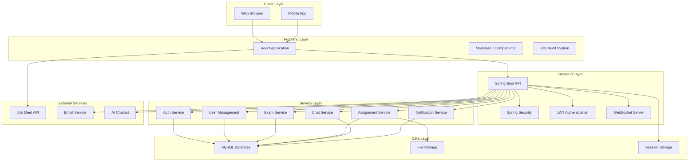

### Component Architecture

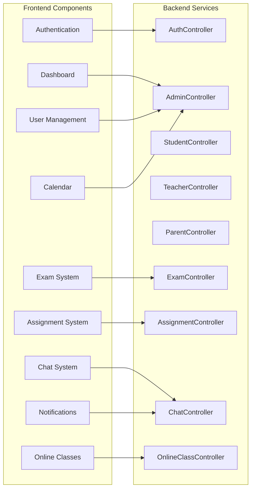

---

## Backend Documentation

### Backend Architecture

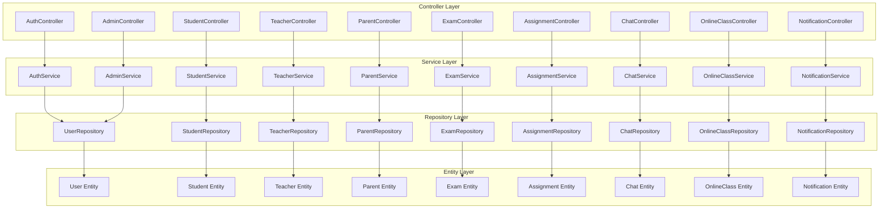

### Backend Package Structure

```
com.epathshala/
├── config/                    # Configuration classes
│   ├── SecurityConfig.java    # Spring Security configuration
│   ├── WebSocketConfig.java   # WebSocket configuration
│   ├── SwaggerConfig.java     # API documentation
│   └── WebConfig.java         # Web configuration
├── controller/                # REST Controllers
│   ├── AuthController.java    # Authentication endpoints
│   ├── AdminController.java   # Admin operations
│   ├── StudentController.java # Student operations
│   ├── TeacherController.java # Teacher operations
│   ├── ParentController.java  # Parent operations
│   ├── ExamController.java    # Exam management
│   ├── AssignmentController.java # Assignment management
│   ├── ChatController.java    # Chat functionality
│   └── OnlineClassController.java # Online classes
├── service/                   # Business logic layer
│   ├── AuthService.java       # Authentication logic
│   ├── AdminService.java      # Admin operations
│   ├── StudentService.java    # Student operations
│   ├── TeacherService.java    # Teacher operations
│   ├── ParentService.java     # Parent operations
│   ├── ExamService.java       # Exam logic
│   ├── AssignmentService.java # Assignment logic
│   ├── ChatService.java       # Chat logic
│   └── OnlineClassService.java # Online class logic
├── repository/                # Data access layer
│   ├── UserRepository.java    # User data access
│   ├── StudentRepository.java # Student data access
│   ├── TeacherRepository.java # Teacher data access
│   ├── ParentRepository.java  # Parent data access
│   ├── ExamRepository.java    # Exam data access
│   ├── AssignmentRepository.java # Assignment data access
│   ├── ChatRepository.java    # Chat data access
│   └── OnlineClassRepository.java # Online class data access
├── entity/                    # JPA entities
│   ├── User.java              # Base user entity
│   ├── Student.java           # Student entity
│   ├── Teacher.java           # Teacher entity
│   ├── Parent.java            # Parent entity
│   ├── Exam.java              # Exam entity
│   ├── Assignment.java        # Assignment entity
│   ├── ChatMessage.java       # Chat message entity
│   └── OnlineClass.java       # Online class entity
├── dto/                       # Data transfer objects
│   ├── LoginRequest.java      # Login DTO
│   ├── UserDTO.java           # User DTO
│   ├── ExamDTO.java           # Exam DTO
│   ├── AssignmentDTO.java     # Assignment DTO
│   └── ChatMessageDTO.java    # Chat message DTO
├── security/                  # Security components
│   ├── JwtUtil.java           # JWT utilities
│   ├── JwtFilter.java         # JWT filter
│   └── CustomUserDetailsService.java # User details service
└── util/                      # Utility classes
    ├── FileUtil.java          # File operations
    └── EmailUtil.java         # Email operations
```

### Backend Flow Diagram

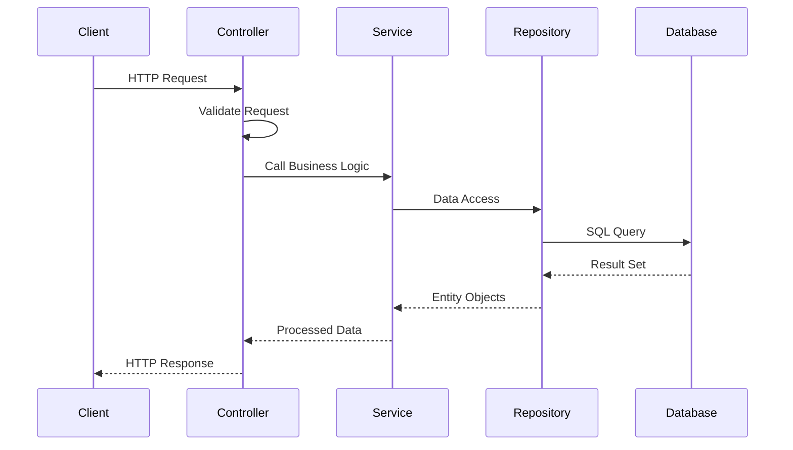

---

## Frontend Documentation

### Frontend Architecture

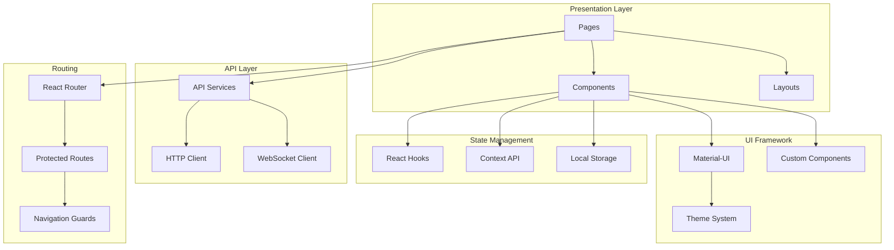

### Frontend Component Structure

```
src/
├── components/                # Reusable components
│   ├── common/               # Common components
│   │   ├── Navbar.jsx        # Navigation bar
│   │   ├── Sidebar.jsx       # Sidebar navigation
│   │   ├── Logo.jsx          # Application logo
│   │   ├── Notifications.jsx # Notification system
│   │   └── Chatbot.jsx       # AI chatbot
│   ├── layout/               # Layout components
│   │   ├── DashboardLayout.jsx # Main dashboard layout
│   │   ├── AdminDashboardLayout.jsx # Admin layout
│   │   ├── StudentDashboardLayout.jsx # Student layout
│   │   ├── TeacherDashboardLayout.jsx # Teacher layout
│   │   └── ParentDashboardLayout.jsx # Parent layout
│   ├── auth/                 # Authentication components
│   │   ├── LoginForm.jsx     # Login form
│   │   └── ForgotPassword.jsx # Password reset
│   ├── dashboard/            # Dashboard components
│   │   ├── StudentOverview.jsx # Student dashboard
│   │   ├── TeacherOverview.jsx # Teacher dashboard
│   │   └── ParentOverview.jsx # Parent dashboard
│   ├── exam/                 # Exam components
│   │   ├── ExamCard.jsx      # Exam display
│   │   ├── MCQExamInterface.jsx # MCQ interface
│   │   └── ExamResultVisualization.jsx # Results
│   ├── assignment/           # Assignment components
│   │   ├── AssignmentCard.jsx # Assignment display
│   │   └── AssignmentSubmission.jsx # Submission form
│   ├── chat/                 # Chat components
│   │   ├── Chat.jsx          # Main chat interface
│   │   ├── ChatMessages.jsx  # Message display
│   │   └── ChatInput.jsx     # Message input
│   └── ui/                   # UI components
│       ├── LoadingSpinner.jsx # Loading indicator
│       ├── ErrorMessage.jsx  # Error display
│       └── EmptyState.jsx    # Empty state
├── pages/                    # Page components
│   ├── auth/                 # Authentication pages
│   │   ├── LoginPage.jsx     # Login page
│   │   └── ForgotPassword.jsx # Password reset page
│   ├── dashboard/            # Dashboard pages
│   │   ├── AdminDashboard.jsx # Admin dashboard
│   │   ├── StudentDashboard.jsx # Student dashboard
│   │   ├── TeacherDashboard.jsx # Teacher dashboard
│   │   └── ParentDashboard.jsx # Parent dashboard
│   ├── HomePage.jsx          # Home page
│   ├── AboutUs.jsx           # About page
│   └── ContactUs.jsx         # Contact page
├── api/                      # API service layer
│   ├── auth.jsx              # Authentication API
│   ├── admin.jsx             # Admin API
│   ├── student.jsx           # Student API
│   ├── teacher.jsx           # Teacher API
│   ├── parent.jsx            # Parent API
│   ├── exams.jsx             # Exam API
│   ├── assignments.jsx       # Assignment API
│   └── notifications.jsx     # Notification API
├── hooks/                    # Custom React hooks
│   └── useApi.js             # API hook
├── utils/                    # Utility functions
│   ├── auth.jsx              # Authentication utilities
│   ├── validation.js         # Form validation
│   └── responsive.js         # Responsive utilities
├── theme/                    # Theme configuration
│   └── theme.js              # Material-UI theme
└── routes/                   # Routing configuration
    └── AppRoutes.jsx         # Main routing
```

### Frontend Flow Diagram

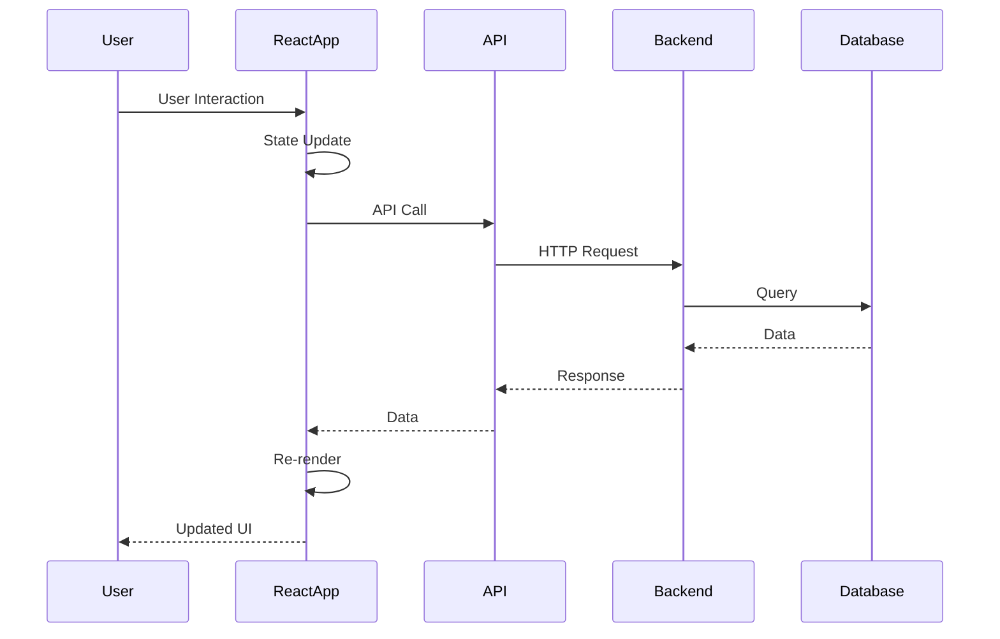

---

## Database Design

### Entity Relationship Diagram

```mermaid
erDiagram
    USER {
        Long id PK
        String username
        String email
        String password
        String role
        Boolean active
        Timestamp createdAt
        Timestamp updatedAt
    }
    
    STUDENT {
        Long id PK
        Long userId FK
        String studentId
        String firstName
        String lastName
        String className
        String section
        String parentEmail
        Timestamp createdAt
    }
    
    TEACHER {
        Long id PK
        Long userId FK
        String teacherId
        String firstName
        String lastName
        String subject
        String department
        Timestamp createdAt
    }
    
    PARENT {
        Long id PK
        Long userId FK
        String parentId
        String firstName
        String lastName
        String phoneNumber
        Timestamp createdAt
    }
    
    EXAM {
        Long id PK
        String title
        String description
        String className
        String subject
        Integer duration
        Integer totalMarks
        Timestamp startTime
        Timestamp endTime
        Boolean isActive
        Long createdBy FK
    }
    
    EXAM_QUESTION {
        Long id PK
        Long examId FK
        String question
        String optionA
        String optionB
        String optionC
        String optionD
        String correctAnswer
        Integer marks
    }
    
    EXAM_ATTEMPT {
        Long id PK
        Long examId FK
        Long studentId FK
        Timestamp startTime
        Timestamp endTime
        Integer score
        Boolean isCompleted
    }
    
    EXAM_ANSWER {
        Long id PK
        Long attemptId FK
        Long questionId FK
        String selectedAnswer
        Boolean isCorrect
    }
    
    ASSIGNMENT {
        Long id PK
        String title
        String description
        String className
        String subject
        String fileName
        String filePath
        Timestamp dueDate
        Integer totalMarks
        Long createdBy FK
        Timestamp createdAt
    }
    
    ASSIGNMENT_SUBMISSION {
        Long id PK
        Long assignmentId FK
        Long studentId FK
        String fileName
        String filePath
        Timestamp submittedAt
        Integer marks
        String feedback
        Boolean isGraded
    }
    
    ATTENDANCE {
        Long id PK
        Long studentId FK
        String className
        String subject
        Date date
        Boolean isPresent
        String remarks
        Long markedBy FK
    }
    
    GRADE {
        Long id PK
        Long studentId FK
        String className
        String subject
        String examType
        Integer marks
        String grade
        Timestamp createdAt
        Long createdBy FK
    }
    
    LEAVE_REQUEST {
        Long id PK
        Long studentId FK
        String reason
        Date startDate
        Date endDate
        String status
        String parentApproval
        String teacherApproval
        Timestamp createdAt
    }
    
    ONLINE_CLASS {
        Long id PK
        String title
        String description
        String className
        String subject
        String meetingId
        String meetingUrl
        Timestamp scheduledTime
        Integer duration
        Long createdBy FK
        Boolean isActive
    }
    
    CHAT_MESSAGE {
        Long id PK
        Long senderId FK
        Long receiverId FK
        String message
        String messageType
        Timestamp timestamp
        Boolean isRead
    }
    
    CHAT_ROOM {
        Long id PK
        String roomName
        String roomType
        Timestamp createdAt
        Long createdBy FK
    }
    
    NOTIFICATION {
        Long id PK
        Long userId FK
        String title
        String message
        String type
        Boolean isRead
        Timestamp createdAt
    }
    
    ACADEMIC_CALENDAR {
        Long id PK
        String title
        String description
        Date eventDate
        String eventType
        String className
        Timestamp createdAt
        Long createdBy FK
    }
    
    USER ||--o{ STUDENT : "has"
    USER ||--o{ TEACHER : "has"
    USER ||--o{ PARENT : "has"
    USER ||--o{ EXAM : "creates"
    USER ||--o{ ASSIGNMENT : "creates"
    USER ||--o{ ONLINE_CLASS : "creates"
    USER ||--o{ ATTENDANCE : "marks"
    USER ||--o{ GRADE : "creates"
    USER ||--o{ CHAT_MESSAGE : "sends"
    USER ||--o{ NOTIFICATION : "receives"
    USER ||--o{ ACADEMIC_CALENDAR : "creates"
    
    EXAM ||--o{ EXAM_QUESTION : "contains"
    EXAM ||--o{ EXAM_ATTEMPT : "has"
    EXAM_ATTEMPT ||--o{ EXAM_ANSWER : "contains"
    EXAM_ATTEMPT }o--|| STUDENT : "attempted_by"
    EXAM_QUESTION ||--o{ EXAM_ANSWER : "answered_in"
    
    ASSIGNMENT ||--o{ ASSIGNMENT_SUBMISSION : "has"
    ASSIGNMENT_SUBMISSION }o--|| STUDENT : "submitted_by"
    
    STUDENT ||--o{ ATTENDANCE : "has"
    STUDENT ||--o{ GRADE : "receives"
    STUDENT ||--o{ LEAVE_REQUEST : "submits"
    STUDENT ||--o{ EXAM_ATTEMPT : "attempts"
    STUDENT ||--o{ ASSIGNMENT_SUBMISSION : "submits"
    
    CHAT_ROOM ||--o{ CHAT_MESSAGE : "contains"
```

### Database Schema Overview

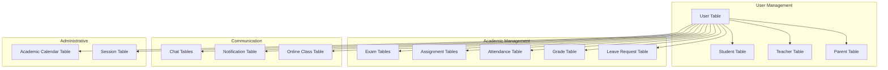

---

## API Documentation

### API Architecture

```mermaid
graph TB
    subgraph "Authentication APIs"
        A[POST /api/auth/login]
        B[POST /api/auth/forgot-password]
        C[POST /api/auth/reset-password]
        D[POST /api/auth/verify-otp]
    end
    
    subgraph "Admin APIs"
        E[GET /api/admin/dashboard]
        F[POST /api/admin/students]
        G[POST /api/admin/teachers]
        H[POST /api/admin/parents]
        I[GET /api/admin/users]
        J[PUT /api/admin/users/{id}]
        K[DELETE /api/admin/users/{id}]
    end
    
    subgraph "Student APIs"
        L[GET /api/student/dashboard]
        M[GET /api/student/exams]
        N[POST /api/student/exams/{id}/attempt]
        O[GET /api/student/assignments]
        P[POST /api/student/assignments/{id}/submit]
        Q[GET /api/student/grades]
        R[GET /api/student/attendance]
    end
    
    subgraph "Teacher APIs"
        S[GET /api/teacher/dashboard]
        T[POST /api/teacher/exams]
        U[GET /api/teacher/exams]
        V[POST /api/teacher/assignments]
        W[GET /api/teacher/assignments]
        X[POST /api/teacher/attendance]
        Y[GET /api/teacher/attendance]
        Z[POST /api/teacher/grades]
    end
    
    subgraph "Parent APIs"
        AA[GET /api/parent/dashboard]
        BB[GET /api/parent/child-progress]
        CC[GET /api/parent/child-attendance]
        DD[GET /api/parent/child-grades]
        EE[POST /api/parent/leave-approval]
    end
    
    subgraph "Communication APIs"
        FF[GET /api/chat/messages]
        GG[POST /api/chat/send]
        HH[GET /api/notifications]
        II[PUT /api/notifications/{id}/read]
        JJ[GET /api/online-classes]
        KK[POST /api/online-classes]
    end
```

### API Flow Diagram

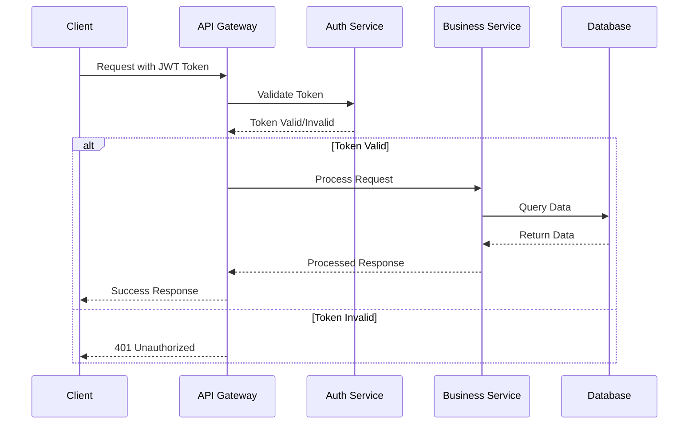

---

## Flow Diagrams

### User Authentication Flow

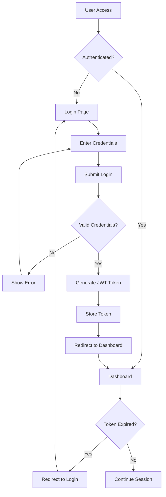

### Exam Management Flow

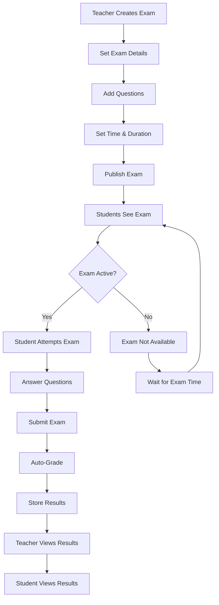

### Assignment Management Flow

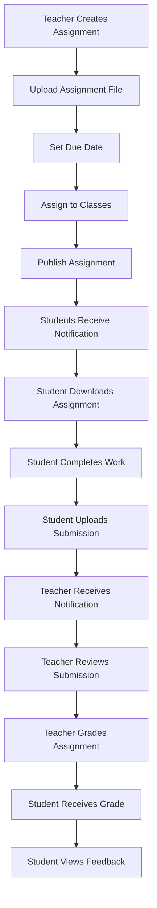

### Real-time Chat Flow

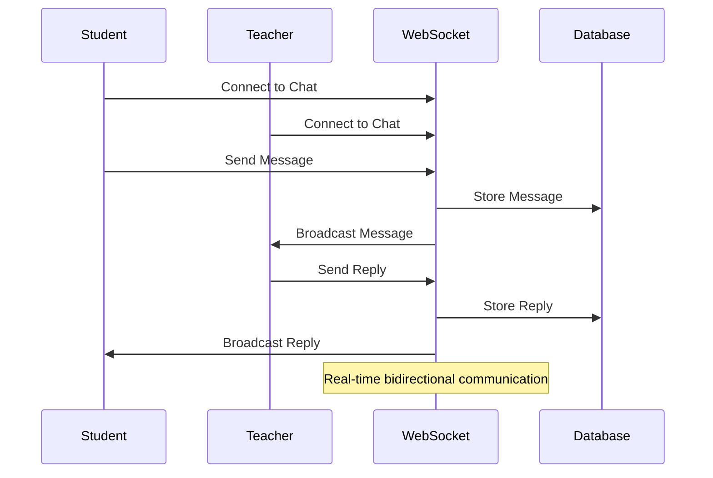

---

## Interview Project Explanation

### Project Overview for Interview

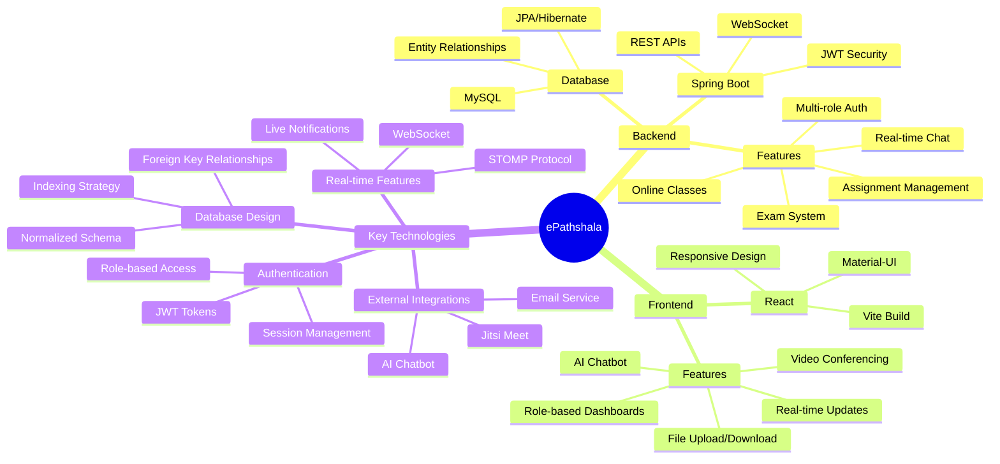

### System Architecture for Interview

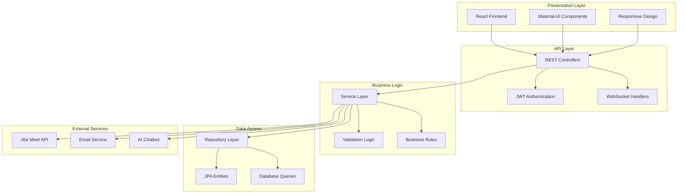

### Key Features Demonstration

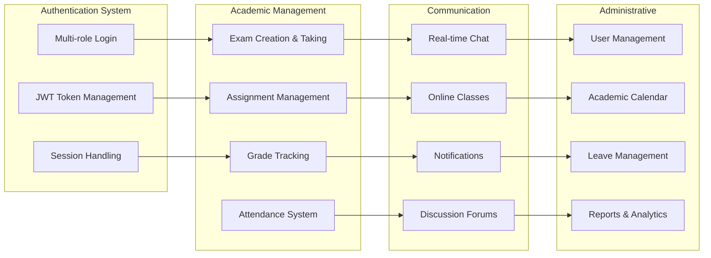

### Technical Implementation Highlights

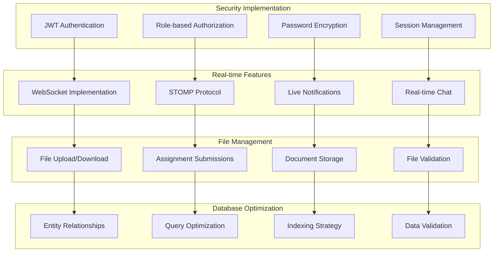

---

## ASCII Diagrams

### System Architecture (ASCII)

```
┌─────────────────────────────────────────────────────────────┐
│                    ePathshala System                        │
├─────────────────────────────────────────────────────────────┤
│                                                             │
│  ┌─────────────┐    ┌─────────────┐    ┌─────────────┐     │
│  │   React     │    │   Spring    │    │   MySQL     │     │
│  │  Frontend   │◄──►│    Boot     │◄──►│  Database   │     │
│  │             │    │   Backend   │    │             │     │
│  └─────────────┘    └─────────────┘    └─────────────┘     │
│         │                   │                   │          │
│         │                   │                   │          │
│  ┌─────────────┐    ┌─────────────┐    ┌─────────────┐     │
│  │ Material-UI │    │   JWT       │    │   File      │     │
│  │ Components  │    │   Security  │    │  Storage    │     │
│  └─────────────┘    └─────────────┘    └─────────────┘     │
│                                                             │
│  ┌─────────────┐    ┌─────────────┐    ┌─────────────┐     │
│  │  WebSocket  │    │   Jitsi     │    │   Email     │     │
│  │   Server    │    │    Meet     │    │  Service    │     │
│  └─────────────┘    └─────────────┘    └─────────────┘     │
│                                                             │
└─────────────────────────────────────────────────────────────┘
```

### User Flow (ASCII)

```
┌─────────────┐
│   User      │
└──────┬──────┘
       │
       ▼
┌─────────────┐
│   Login     │
└──────┬──────┘
       │
       ▼
┌─────────────┐
│  Dashboard  │
└──────┬──────┘
       │
       ▼
┌─────────────┐
│   Features  │
│             │
│ • Exams     │
│ • Assignments│
│ • Chat      │
│ • Classes   │
└─────────────┘
```

### Database Schema (ASCII)

```
┌─────────────┐
│    USER     │
│             │
│ • id        │
│ • username  │
│ • email     │
│ • password  │
│ • role      │
└──────┬──────┘
       │
       │ 1:N
       ▼
┌─────────────┐
│   STUDENT   │
│             │
│ • id        │
│ • userId    │
│ • firstName │
│ • lastName  │
│ • className │
└─────────────┘

┌─────────────┐
│    EXAM     │
│             │
│ • id        │
│ • title     │
│ • className │
│ • duration  │
│ • createdBy │
└──────┬──────┘
       │
       │ 1:N
       ▼
┌─────────────┐
│EXAM_QUESTION│
│             │
│ • id        │
│ • examId    │
│ • question  │
│ • options   │
│ • correct   │
└─────────────┘
```

---

## Markmap Structure

```markmap
# ePathshala Project Structure

## Backend (Spring Boot)
### Controllers
- AuthController
- AdminController
- StudentController
- TeacherController
- ParentController
- ExamController
- AssignmentController
- ChatController
- OnlineClassController

### Services
- AuthService
- AdminService
- StudentService
- TeacherService
- ParentService
- ExamService
- AssignmentService
- ChatService
- OnlineClassService

### Entities
- User
- Student
- Teacher
- Parent
- Exam
- Assignment
- ChatMessage
- OnlineClass
- Notification

### Security
- JWT Authentication
- Role-based Authorization
- Password Encryption
- Session Management

## Frontend (React)
### Components
- Authentication
- Dashboard
- User Management
- Exam System
- Assignment System
- Chat System
- Online Classes
- Notifications

### Pages
- Login/Register
- Admin Dashboard
- Student Dashboard
- Teacher Dashboard
- Parent Dashboard
- Exam Interface
- Assignment Interface
- Chat Interface

### Features
- Material-UI Design
- Responsive Layout
- Real-time Updates
- File Upload/Download
- Video Conferencing
- AI Chatbot

## Database (MySQL)
### Tables
- User Management
- Academic Records
- Communication
- File Storage
- Session Management

## External Integrations
- Jitsi Meet
- Email Service
- AI Chatbot
- File Storage
```

---

## Conclusion

This comprehensive documentation provides a complete overview of the ePathshala Educational Management System. The project demonstrates modern full-stack development practices with:

- **Robust Backend Architecture** using Spring Boot with proper separation of concerns
- **Modern Frontend** built with React and Material-UI
- **Secure Authentication** using JWT tokens and role-based access control
- **Real-time Features** implemented with WebSocket technology
- **Comprehensive Database Design** with proper relationships and normalization
- **External Integrations** for enhanced functionality

The system is designed to be scalable, maintainable, and user-friendly, making it an excellent example of a modern educational management platform.

---

*This documentation serves as a complete reference for understanding, maintaining, and extending the ePathshala system.*
