# Database ER Diagrams - Multiple Formats

## 1. Complete Database Schema (Mermaid ERD)

```mermaid
erDiagram
    USER {
        Long id PK
        String username UK
        String email UK
        String password
        String role
        Boolean active
        Timestamp createdAt
        Timestamp updatedAt
    }
    
    STUDENT {
        Long id PK
        Long userId FK
        String studentId UK
        String firstName
        String lastName
        String className
        String section
        String parentEmail
        String phoneNumber
        String address
        Date dateOfBirth
        String gender
        Timestamp createdAt
        Timestamp updatedAt
    }
    
    TEACHER {
        Long id PK
        Long userId FK
        String teacherId UK
        String firstName
        String lastName
        String subject
        String department
        String qualification
        String experience
        String phoneNumber
        String email
        Timestamp createdAt
        Timestamp updatedAt
    }
    
    PARENT {
        Long id PK
        Long userId FK
        String parentId UK
        String firstName
        String lastName
        String phoneNumber
        String email
        String occupation
        String address
        Timestamp createdAt
        Timestamp updatedAt
    }
    
    EXAM {
        Long id PK
        String title
        String description
        String className
        String subject
        Integer duration
        Integer totalMarks
        Timestamp startTime
        Timestamp endTime
        Boolean isActive
        Boolean isPublished
        Long createdBy FK
        Timestamp createdAt
        Timestamp updatedAt
    }
    
    EXAM_QUESTION {
        Long id PK
        Long examId FK
        String question
        String optionA
        String optionB
        String optionC
        String optionD
        String correctAnswer
        Integer marks
        Integer questionOrder
        Timestamp createdAt
    }
    
    EXAM_ATTEMPT {
        Long id PK
        Long examId FK
        Long studentId FK
        Timestamp startTime
        Timestamp endTime
        Integer score
        Integer totalMarks
        Boolean isCompleted
        Boolean isSubmitted
        Timestamp createdAt
    }
    
    EXAM_ANSWER {
        Long id PK
        Long attemptId FK
        Long questionId FK
        String selectedAnswer
        Boolean isCorrect
        Timestamp answeredAt
    }
    
    ASSIGNMENT {
        Long id PK
        String title
        String description
        String className
        String subject
        String fileName
        String filePath
        String fileType
        Long fileSize
        Timestamp dueDate
        Integer totalMarks
        Boolean isActive
        Long createdBy FK
        Timestamp createdAt
        Timestamp updatedAt
    }
    
    ASSIGNMENT_SUBMISSION {
        Long id PK
        Long assignmentId FK
        Long studentId FK
        String fileName
        String filePath
        String fileType
        Long fileSize
        Timestamp submittedAt
        Integer marks
        String feedback
        Boolean isGraded
        Timestamp gradedAt
        Long gradedBy FK
    }
    
    ATTENDANCE {
        Long id PK
        Long studentId FK
        String className
        String subject
        Date date
        Boolean isPresent
        String remarks
        Long markedBy FK
        Timestamp createdAt
        Timestamp updatedAt
    }
    
    GRADE {
        Long id PK
        Long studentId FK
        String className
        String subject
        String examType
        Integer marks
        String grade
        String remarks
        Timestamp createdAt
        Long createdBy FK
        Timestamp updatedAt
    }
    
    LEAVE_REQUEST {
        Long id PK
        Long studentId FK
        String reason
        Date startDate
        Date endDate
        String status
        String parentApproval
        String teacherApproval
        String adminApproval
        String rejectionReason
        Timestamp createdAt
        Timestamp updatedAt
    }
    
    ONLINE_CLASS {
        Long id PK
        String title
        String description
        String className
        String subject
        String meetingId
        String meetingUrl
        String meetingPassword
        Timestamp scheduledTime
        Integer duration
        Boolean isActive
        Boolean isRecorded
        Long createdBy FK
        Timestamp createdAt
        Timestamp updatedAt
    }
    
    CHAT_MESSAGE {
        Long id PK
        Long senderId FK
        Long receiverId FK
        Long roomId FK
        String message
        String messageType
        String fileName
        String filePath
        Timestamp timestamp
        Boolean isRead
        Boolean isDeleted
        Timestamp createdAt
    }
    
    CHAT_ROOM {
        Long id PK
        String roomName
        String roomType
        String description
        Boolean isActive
        Timestamp createdAt
        Long createdBy FK
        Timestamp updatedAt
    }
    
    NOTIFICATION {
        Long id PK
        Long userId FK
        String title
        String message
        String type
        String priority
        Boolean isRead
        String actionUrl
        Timestamp createdAt
        Timestamp readAt
    }
    
    ACADEMIC_CALENDAR {
        Long id PK
        String title
        String description
        Date eventDate
        String eventType
        String className
        String location
        Boolean isHoliday
        Timestamp createdAt
        Long createdBy FK
        Timestamp updatedAt
    }
    
    SESSION {
        Long id PK
        Long userId FK
        String sessionToken
        String ipAddress
        String userAgent
        Timestamp loginTime
        Timestamp lastActivity
        Boolean isActive
        Timestamp expiresAt
    }
    
    OTP {
        Long id PK
        String email
        String otpCode
        String purpose
        Boolean isUsed
        Timestamp createdAt
        Timestamp expiresAt
    }
    
    FORUM_CATEGORY {
        Long id PK
        String name
        String description
        String icon
        Boolean isActive
        Timestamp createdAt
        Long createdBy FK
    }
    
    FORUM_THREAD {
        Long id PK
        Long categoryId FK
        Long authorId FK
        String title
        String content
        Integer viewCount
        Integer replyCount
        Boolean isPinned
        Boolean isLocked
        Timestamp createdAt
        Timestamp updatedAt
    }
    
    FORUM_REPLY {
        Long id PK
        Long threadId FK
        Long authorId FK
        String content
        Boolean isSolution
        Timestamp createdAt
        Timestamp updatedAt
    }
    
    USER ||--o{ STUDENT : "has"
    USER ||--o{ TEACHER : "has"
    USER ||--o{ PARENT : "has"
    USER ||--o{ EXAM : "creates"
    USER ||--o{ ASSIGNMENT : "creates"
    USER ||--o{ ONLINE_CLASS : "creates"
    USER ||--o{ ATTENDANCE : "marks"
    USER ||--o{ GRADE : "creates"
    USER ||--o{ CHAT_MESSAGE : "sends"
    USER ||--o{ NOTIFICATION : "receives"
    USER ||--o{ ACADEMIC_CALENDAR : "creates"
    USER ||--o{ SESSION : "has"
    USER ||--o{ FORUM_THREAD : "creates"
    USER ||--o{ FORUM_REPLY : "creates"
    
    EXAM ||--o{ EXAM_QUESTION : "contains"
    EXAM ||--o{ EXAM_ATTEMPT : "has"
    EXAM_ATTEMPT ||--o{ EXAM_ANSWER : "contains"
    EXAM_ATTEMPT }o--|| STUDENT : "attempted_by"
    EXAM_QUESTION ||--o{ EXAM_ANSWER : "answered_in"
    
    ASSIGNMENT ||--o{ ASSIGNMENT_SUBMISSION : "has"
    ASSIGNMENT_SUBMISSION }o--|| STUDENT : "submitted_by"
    ASSIGNMENT_SUBMISSION }o--|| USER : "graded_by"
    
    STUDENT ||--o{ ATTENDANCE : "has"
    STUDENT ||--o{ GRADE : "receives"
    STUDENT ||--o{ LEAVE_REQUEST : "submits"
    STUDENT ||--o{ EXAM_ATTEMPT : "attempts"
    STUDENT ||--o{ ASSIGNMENT_SUBMISSION : "submits"
    
    CHAT_ROOM ||--o{ CHAT_MESSAGE : "contains"
    
    FORUM_CATEGORY ||--o{ FORUM_THREAD : "contains"
    FORUM_THREAD ||--o{ FORUM_REPLY : "contains"
```

## 2. User Management Schema (Mermaid)

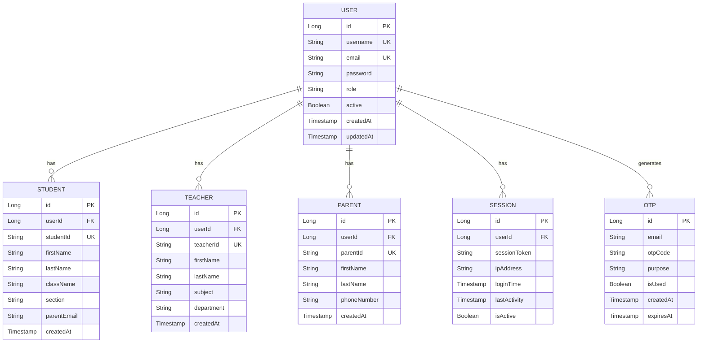

## 3. Academic Management Schema (Mermaid)

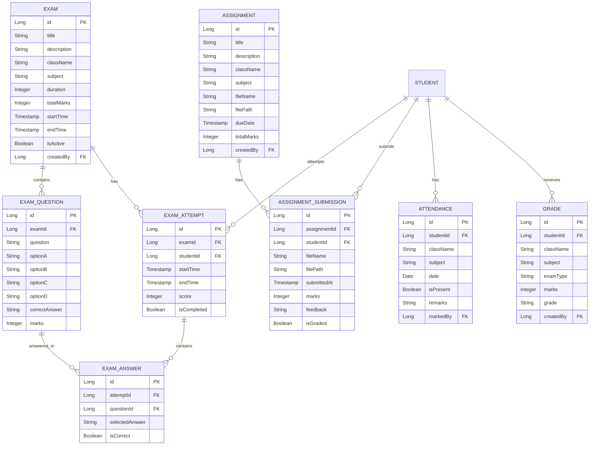

## 4. Communication Schema (Mermaid)

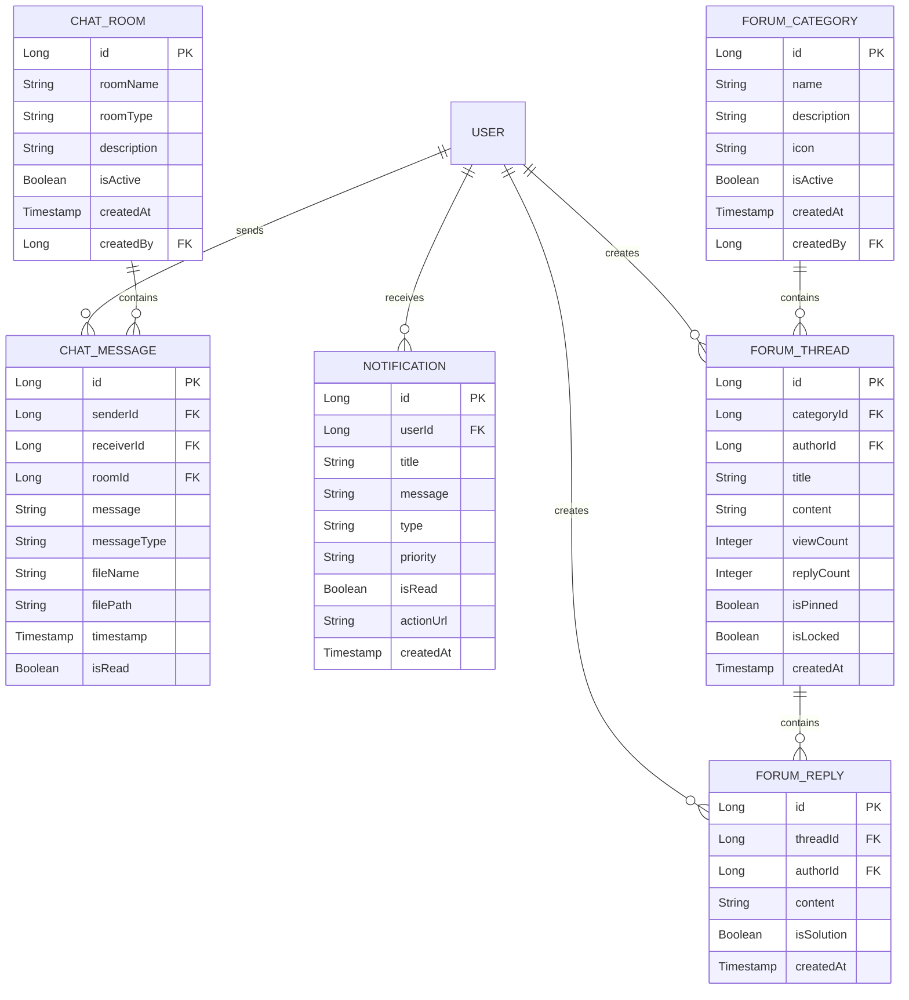

## 5. Database Indexing Strategy (Mermaid)

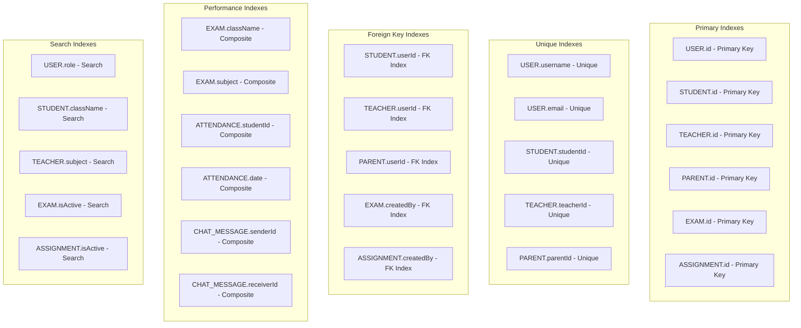

## 6. Database Relationships (Mermaid)

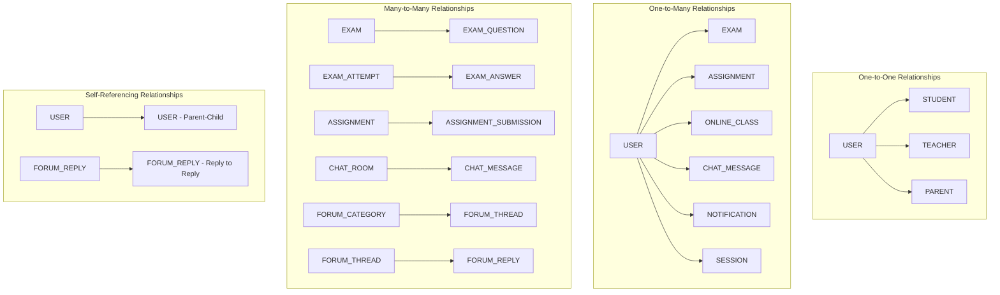

## 7. Database Constraints (Mermaid)

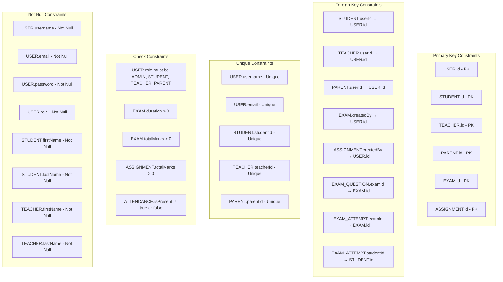

## 8. Database Triggers (Mermaid)

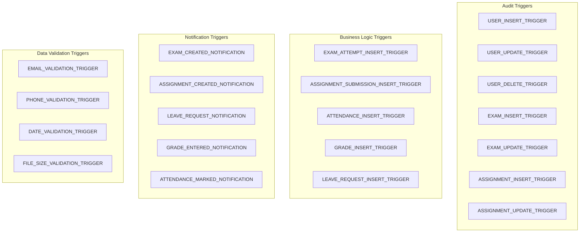

## 9. Database Views (Mermaid)

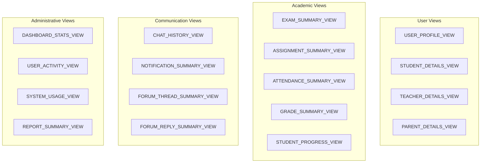

## 10. Database Stored Procedures (Mermaid)

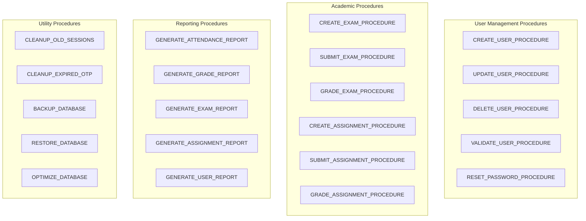

## 11. Database Backup Strategy (Mermaid)

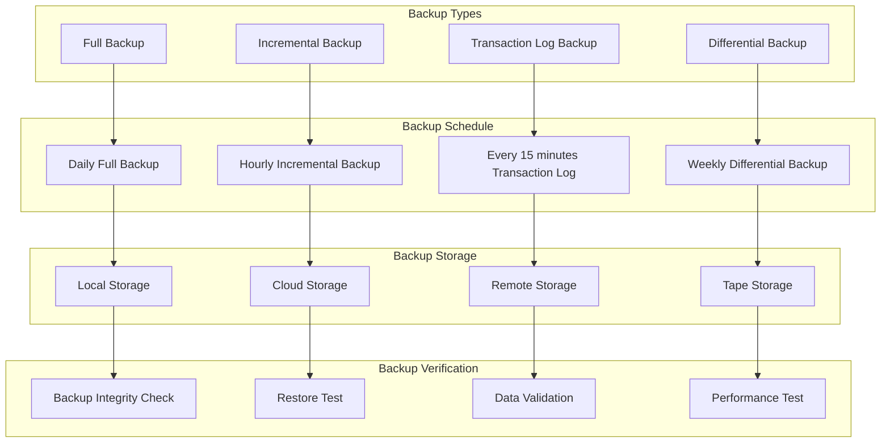

## 12. Database Performance Monitoring (Mermaid)

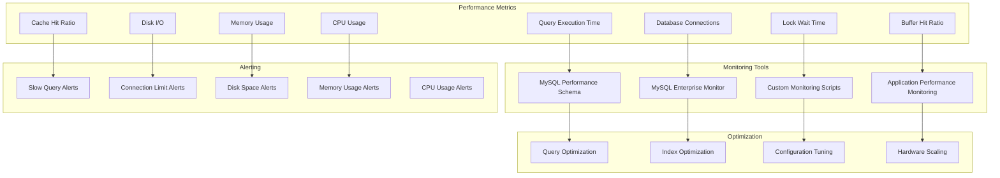

---

*These database ER diagrams provide a comprehensive view of the database schema, relationships, constraints, and performance optimization strategies for the ePathshala system.*
