# Frontend Component Diagrams - Multiple Formats

## 1. React Component Hierarchy (Mermaid)

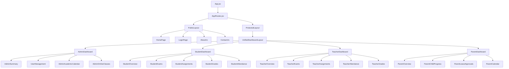

## 2. Component Architecture (Mermaid)

```mermaid
graph TB
    subgraph "Layout Components"
        A[UnifiedDashboardLayout]
        B[AdminDashboardLayout]
        C[StudentDashboardLayout]
        D[TeacherDashboardLayout]
        E[ParentDashboardLayout]
        F[PublicLayout]
    end
    
    subgraph "Navigation Components"
        G[UnifiedNavigation]
        H[Sidebar]
        I[Navbar]
        J[Breadcrumb]
    end
    
    subgraph "Dashboard Components"
        K[StudentOverview]
        L[TeacherOverview]
        M[ParentOverview]
        N[AdminStatsCard]
        O[AdminActivityFeed]
    end
    
    subgraph "Feature Components"
        P[ExamCard]
        Q[MCQExamInterface]
        R[AssignmentCard]
        S[AssignmentSubmission]
        T[Chat]
        U[JitsiMeet]
        V[Notifications]
    end
    
    subgraph "UI Components"
        W[LoadingSpinner]
        X[ErrorMessage]
        Y[EmptyState]
        Z[FormikForm]
    end
    
    A --> G
    A --> H
    A --> I
    B --> G
    C --> G
    D --> G
    E --> G
    
    A --> K
    A --> L
    A --> M
    A --> N
    A --> O
    
    A --> P
    A --> Q
    A --> R
    A --> S
    A --> T
    A --> U
    A --> V
    
    A --> W
    A --> X
    A --> Y
    A --> Z
```

## 3. State Management Flow (Mermaid)

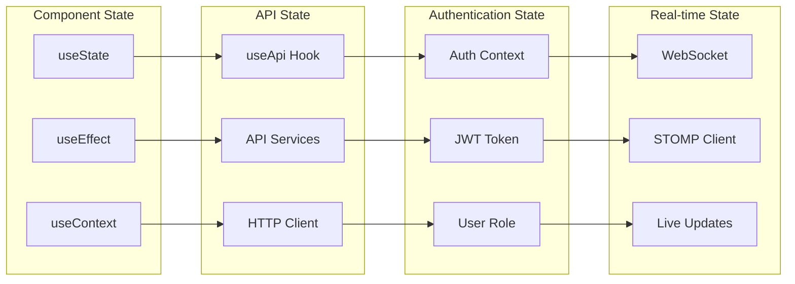

## 4. Component Communication (Mermaid)

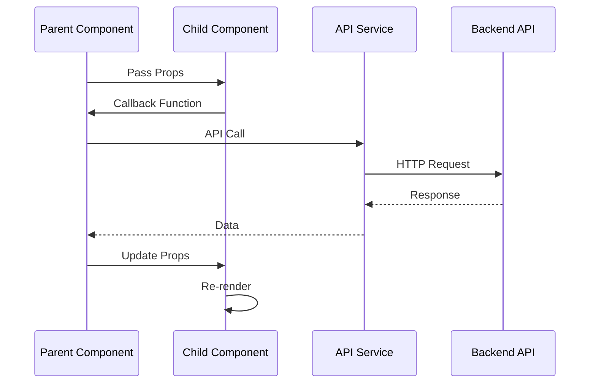

## 5. Routing Structure (Mermaid)

```mermaid
graph TD
    A[AppRoutes] --> B[Public Routes]
    A --> C[Protected Routes]
    
    B --> D[/ - HomePage]
    B --> E[/login - LoginPage]
    B --> F[/about - AboutUs]
    B --> G[/contact - ContactUs]
    
    C --> H[/dashboard - Dashboard]
    C --> I[/admin - Admin Routes]
    C --> J[/student - Student Routes]
    C --> K[/teacher - Teacher Routes]
    C --> L[/parent - Parent Routes]
    
    I --> M[/admin/users - UserManagement]
    I --> N[/admin/calendar - AcademicCalendar]
    I --> O[/admin/classes - OnlineClasses]
    
    J --> P[/student/exams - StudentExams]
    J --> Q[/student/assignments - StudentAssignments]
    J --> R[/student/grades - StudentGrades]
    
    K --> S[/teacher/exams - TeacherExams]
    K --> T[/teacher/assignments - TeacherAssignments]
    K --> U[/teacher/attendance - TeacherAttendance]
    
    L --> V[/parent/progress - ChildProgress]
    L --> W[/parent/approvals - LeaveApprovals]
    L --> X[/parent/calendar - ParentCalendar]
```

## 6. Material-UI Theme Structure (Mermaid)

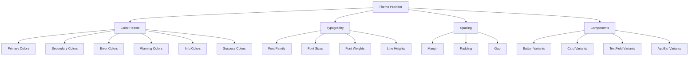

## 7. API Integration Flow (Mermaid)

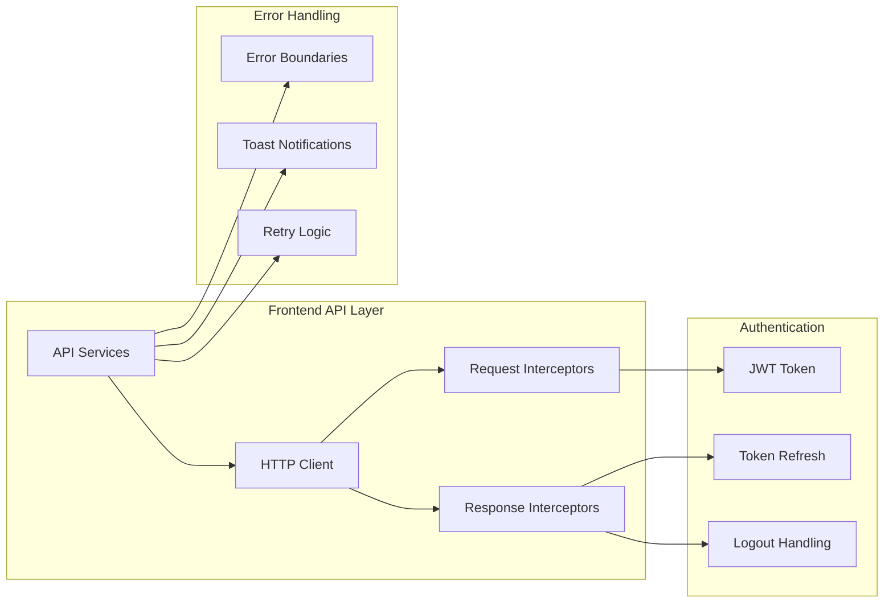

## 8. Component Lifecycle (Mermaid)

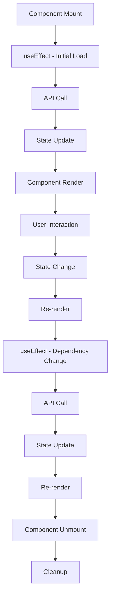

## 9. Form Handling Flow (Mermaid)

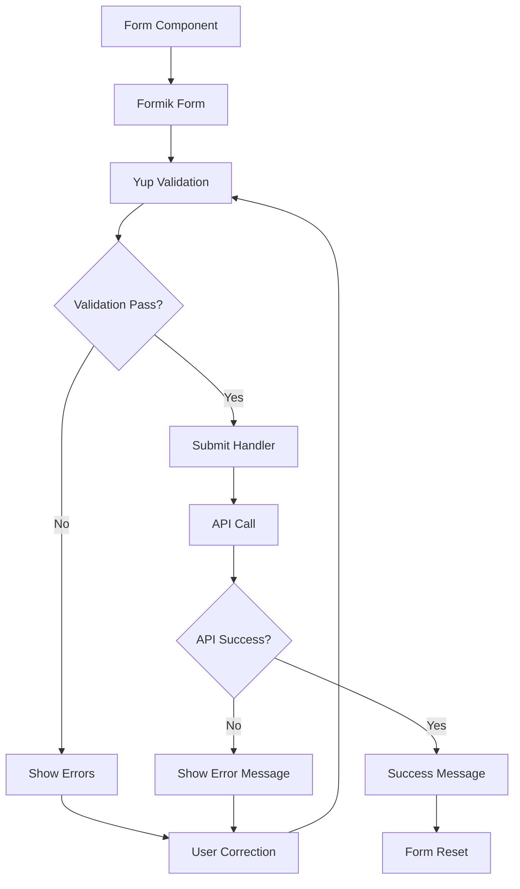

## 10. Real-time Updates Flow (Mermaid)

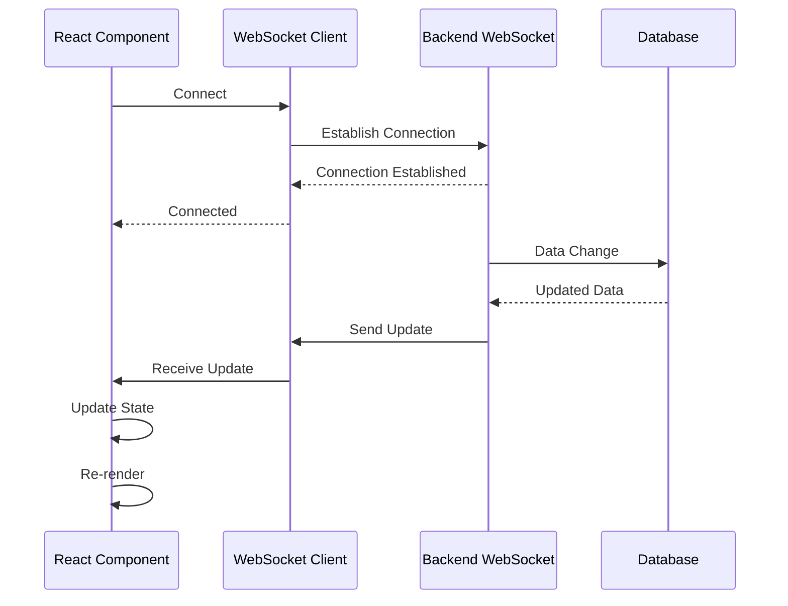

## 11. File Upload Component Flow (Mermaid)

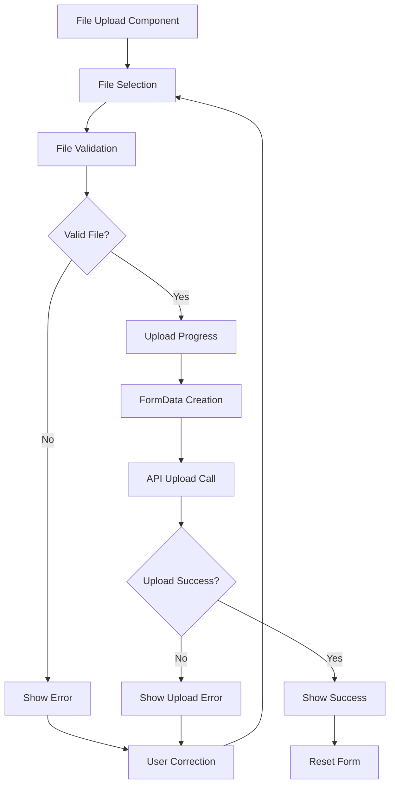

## 12. Responsive Design Flow (Mermaid)

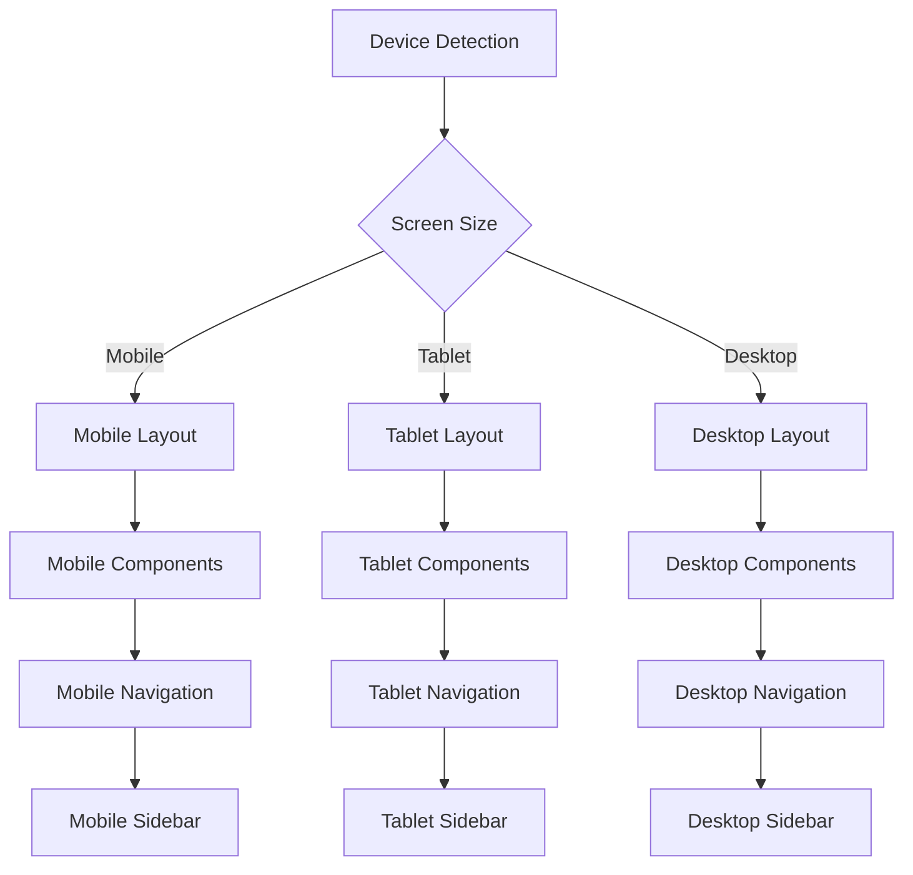

## 13. Component Testing Structure (Mermaid)

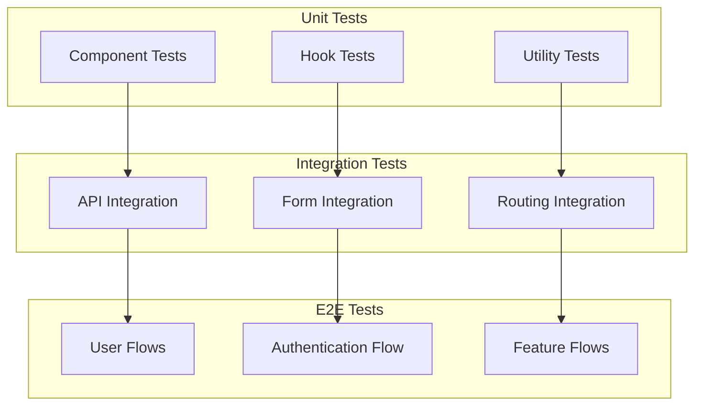

## 14. Performance Optimization (Mermaid)

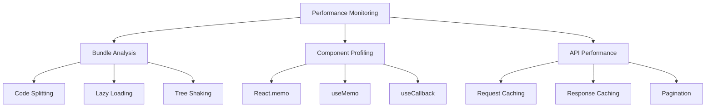

## 15. Error Handling Architecture (Mermaid)

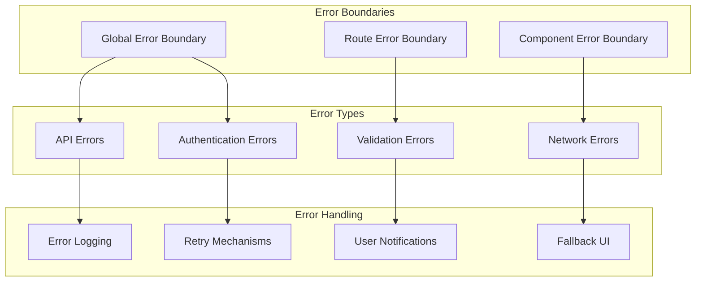

## 16. Component Props Flow (Mermaid)

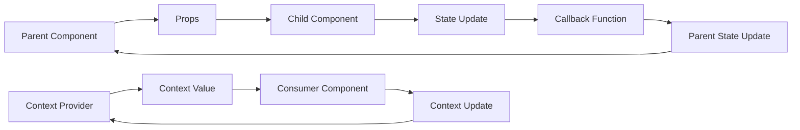

## 17. Build and Deployment Flow (Mermaid)

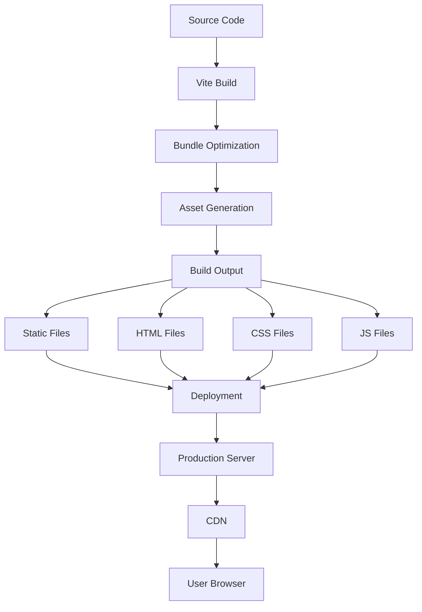

## 18. Component Reusability (Mermaid)

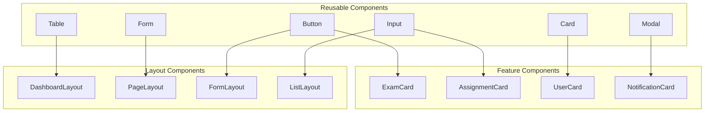

## 19. State Management Patterns (Mermaid)

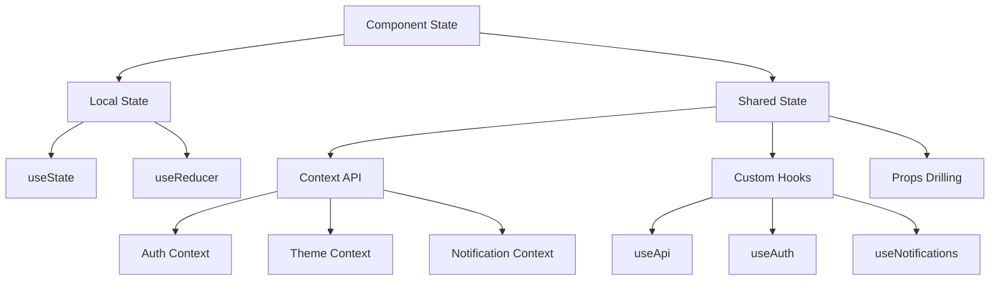

## 20. Component Composition (Mermaid)

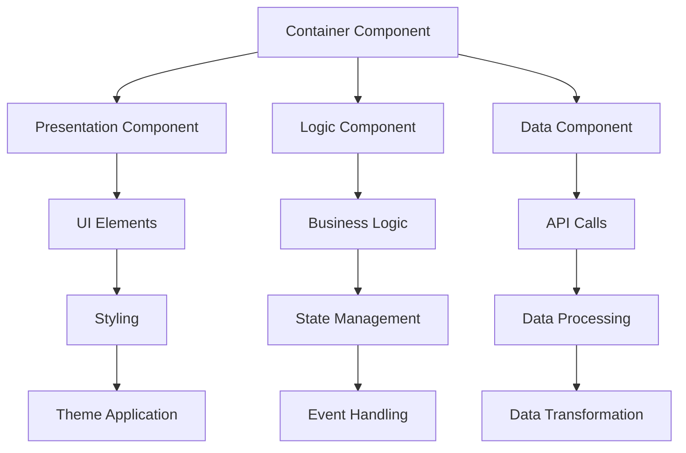

---

*These diagrams provide a comprehensive view of the frontend architecture, component relationships, and data flow patterns in the React application.*
