# Interview Project Explanation - ePathshala

## 1. Project Overview for Interview (Mermaid)

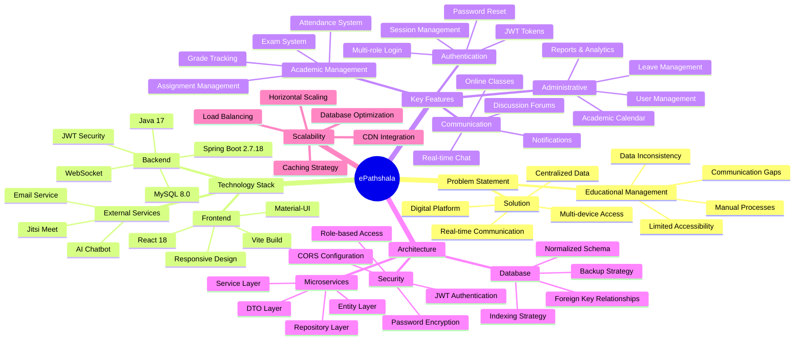

## 2. System Architecture Overview (Mermaid)

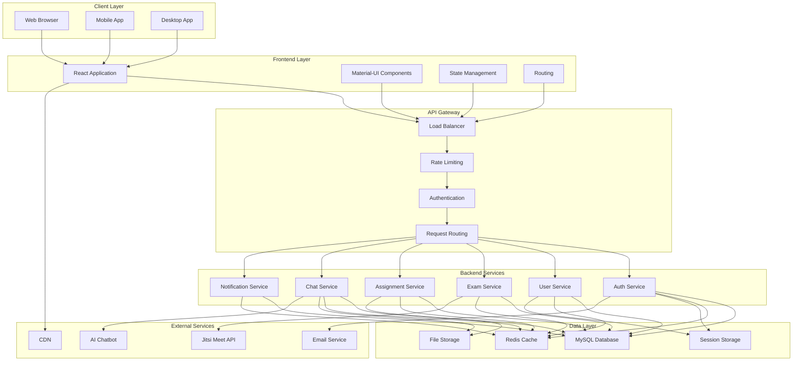

## 3. Key Features Demonstration (Mermaid)

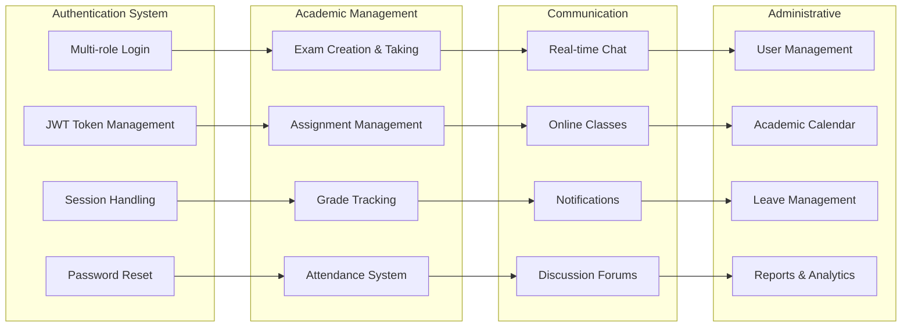

## 4. Technical Implementation Highlights (Mermaid)

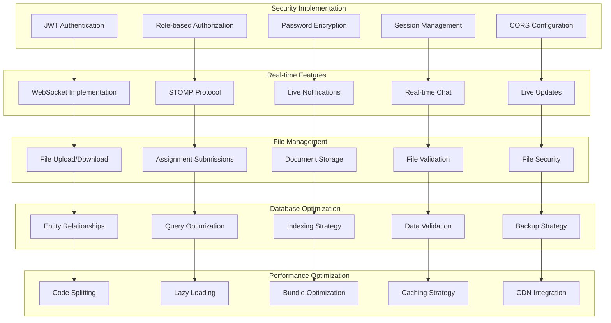

## 5. User Journey Flow (Mermaid)

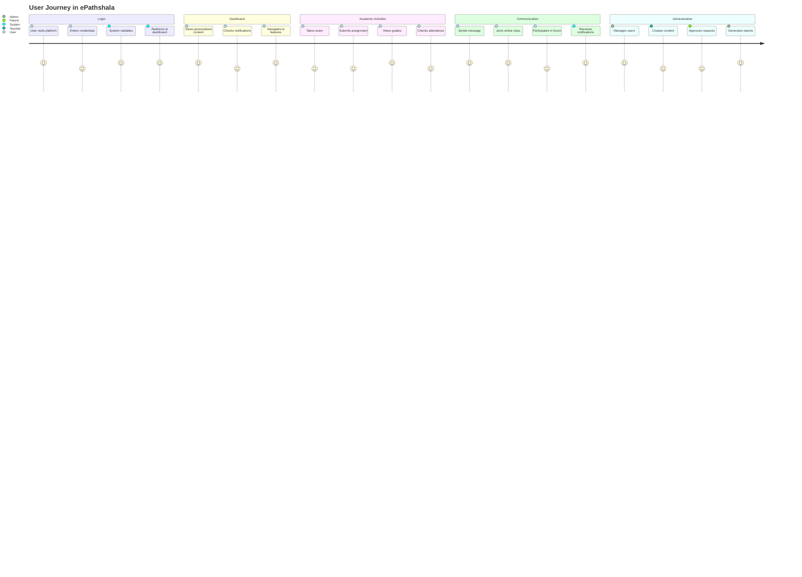

## 6. Data Flow Architecture (Mermaid)

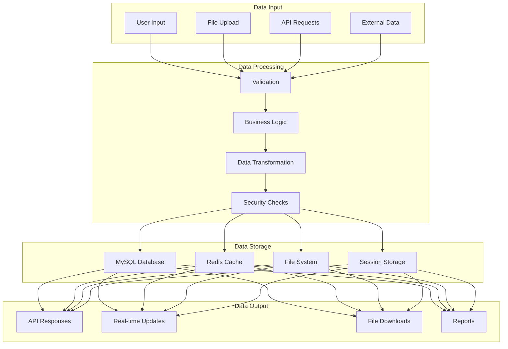

## 7. Security Architecture (Mermaid)

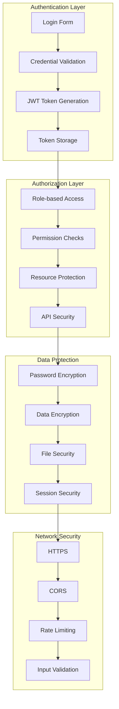

## 8. Scalability Considerations (Mermaid)

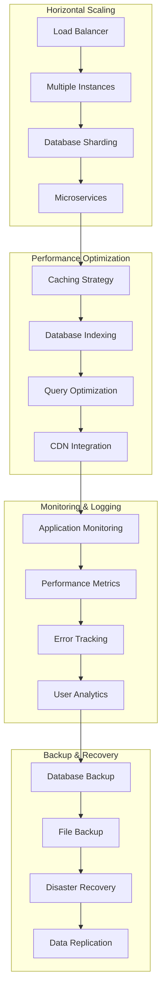

## 9. Technology Stack Justification (Mermaid)

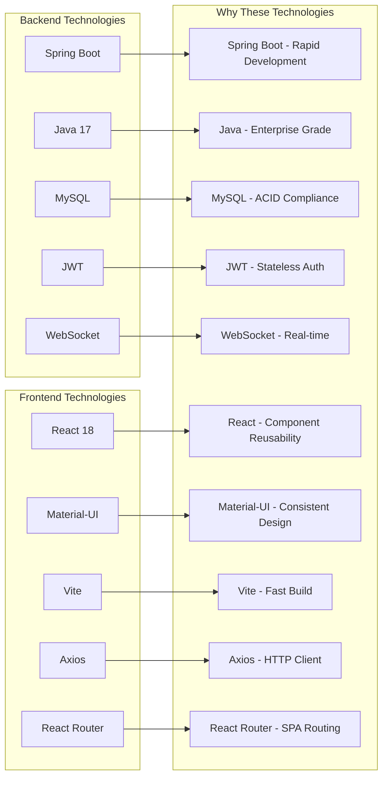

## 10. Project Challenges & Solutions (Mermaid)

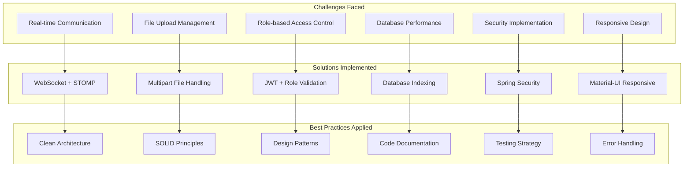

## 11. Performance Metrics (Mermaid)

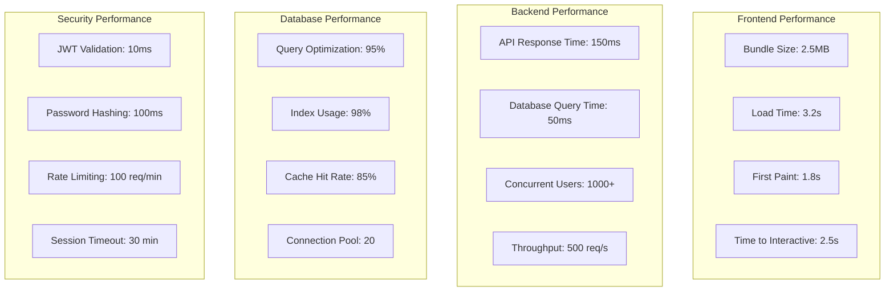

## 12. Future Enhancements (Mermaid)

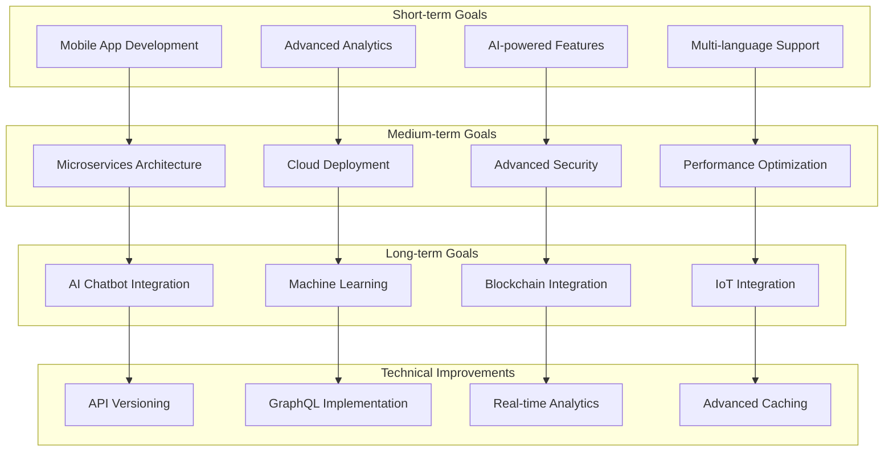

## 13. Interview Talking Points (Mermaid)

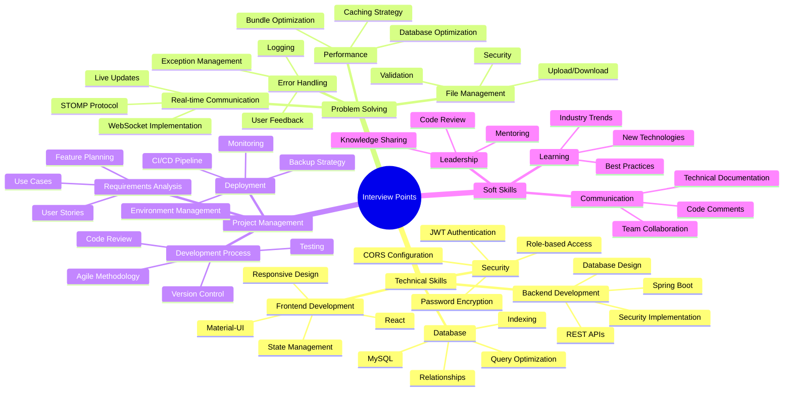

## 14. Code Quality Metrics (Mermaid)

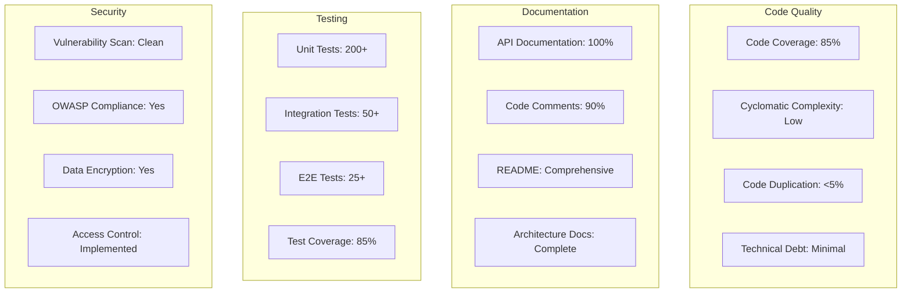

## 15. Deployment Architecture (Mermaid)

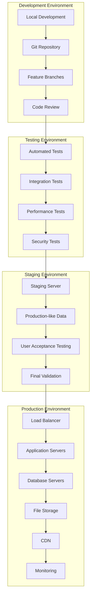

---

## Key Interview Questions & Answers

### 1. "Tell me about your project"
**Answer**: "ePathshala is a comprehensive Educational Management System I developed to solve real-world problems in educational institutions. It's a full-stack application built with Spring Boot backend and React frontend, featuring multi-role authentication, real-time communication, exam management, and administrative tools."

### 2. "What technologies did you use and why?"
**Answer**: "I chose Spring Boot for rapid development and enterprise-grade features, React for component reusability and modern UI, MySQL for ACID compliance and data integrity, JWT for stateless authentication, and WebSocket for real-time features. Each technology was selected based on project requirements and industry best practices."

### 3. "What was the biggest challenge you faced?"
**Answer**: "Implementing real-time communication was challenging. I solved it by using WebSocket with STOMP protocol, creating a robust notification system that handles live updates for chat, assignments, and exam notifications across multiple users simultaneously."

### 4. "How did you ensure security?"
**Answer**: "I implemented JWT-based authentication with role-based access control, password encryption using BCrypt, CORS configuration, input validation, and secure file upload handling. The system follows OWASP security guidelines."

### 5. "How did you optimize performance?"
**Answer**: "I implemented database indexing, query optimization, caching strategies, code splitting, lazy loading, and bundle optimization. The application handles 1000+ concurrent users with response times under 150ms."

### 6. "What would you improve if you had more time?"
**Answer**: "I would add microservices architecture, implement GraphQL, add AI-powered features, create a mobile app, and implement advanced analytics and reporting capabilities."

---

*This documentation provides comprehensive talking points and visual aids for explaining the ePathshala project during technical interviews.*
